## 1 集合Collection


### 1.1 collection

collection 接口常用方法：

add（object obj) , addAll(Collection coll) , size(), isEmpty(), clear()

需要重写equals方法的：

contains（object obj) , containsAll(Collection coll), remove(Object obj), removeAll(Collection coll), retainsAll（Collection coll)交集

hashCode(), toArray(),iterator();

#### 1.1.1 数组转向集合的注意事项

使用Arrays.asList()的原因无非是想将数组或一些元素转为集合,而你得到的集合并不一定是你想要的那个集合。

而一开始asList的设计时用于打印数组而设计的，但jdk1.5开始，有了另一个比较更方便的打印函数Arrays.toString(),于是打印不再使用asList()，而asList()恰巧可用于将数组转为集合。

**1、错误用法**

如果你这样使用过，那你可要注意了。

**错误一**

将基本类型数组作为asList的参数

```java
int[] arr = {1,2,3};

List list = Arrays.asList(arr);

System.out.println(list.size());
```

猜一下输出结果？

**错误二**

将数组作为asList参数后，修改数组或List

```
String[] arr = {"欢迎","关注","Java"};

List list = Arrays.asList(arr);

arr[1] = "爱上";

list.set(2,"我");

System.out.println(Arrays.toString(arr));

System.out.println(list.toString());
```

猜一下输出结果？

**错误三**

数组转换为集合后，进行增删元素

```
String[] arr = {"欢迎","关注","Java"};

List list = Arrays.asList(arr);

list.add("新增");

list.remove("关注");

System.out.println(list.toString());
```

猜一下输出结果？

你是不是以为上面 👆那个 list 是` java.util.ArrayList `?

答案很确定：NO ! 

**2、深入探究**

我们通过asList()源码可发现其原因，但为了更直观，我们先通过IDEA debug来看看结果。

```
List<String> asList = Arrays.asList(``"欢迎"``,``"关注"``,``"码上实战"``);` `ArrayList<String> aList = ``new` `ArrayList<>(asList);
```


其实它返回的是 `java.util.Arrays.ArrayList`，这个家伙是谁呢？

请看下源码：

```
public class Arrays {
 //省略其他方法
 public static <T> List<T> asList(T... a) {
 return new ArrayList<>(a);
 }

 //就是这个家伙  👇
 private static class ArrayList<E> extends AbstractList<E>
  implements RandomAccess, java.io.Serializable{
 private final E[] a;

 ArrayList(E[] array) {
  a = Objects.requireNonNull(array);
 }

 @Override
 public int size() {
  return a.length;
 }
 //省略其他方法
 }

}
```

但它和ArrayList貌似很像唉！有什么不同吗？

**3、不同之处**

Arrays.ArrayList 是工具类 Arrays 的一个内部静态类，它没有完全实现List的方法，而 ArrayList直接实现了List 接口，实现了List所有方法。


**长度不同 和 实现的方法不同**

Arrays.ArrayList是一个定长集合，因为它没有重写add,remove方法，所以一旦初始化元素后，集合的size就是不可变的。

**参数赋值方式不同**

Arrays.ArrayList将外部数组的引用直接通过“=”赋予内部的泛型数组，所以本质指向同一个数组。

```
ArrayList(E[] array) {
 a = array;
}
```

ArrayList是将其他集合转为数组后copy到自己内部的数组的。

```
public ArrayList(Collection<? extends E> c) {
 // toArray 底层使用的是 数组clone 或 System.arraycopy
 elementData = c.toArray();
}
```

**4、揭晓答案**

**错误一**

由于Arrays.ArrayList参数为可变长泛型，而基本类型是无法泛型化的，所以它把int[] arr数组当成了一个泛型对象，所以集合中最终只有一个元素arr。

**错误二**

​     由于asList产生的集合元素是直接引用作为参数的数组，所以当外部数组或集合改变时，数组和集合会同步变化，这在平时我们编码时可能产生莫名的问题。

**错误三**

由于asList产生的集合并没有重写add,remove等方法，所以它会调用父类AbstractList的方法，而父类的方法中抛出的却是异常信息。

**5、支持基础类型的方式**

如果使用Spring

```
int[] a = {1,2,3};
List list = CollectionUtils.arrayToList(a);
System.out.println(list);
```

如果使用Java 8

```
int intArray[] = {1, 2, 3};
List<Integer> iList = Arrays.stream(intArray)
       .boxed()
       .collect(Collectors.toList());
System.out.println(iList);
```

**6、数组转ArrayList**

**遍历转换**

```
Integer intArray[] = {1, 2, 3};
ArrayList<Integer> aList = new ArrayList<>();
for (Integer i: intArray){
 aList.add(i);
}
```

显然这种方式不够优雅！反正我不愿意使用。

**使用工具类**

上面方案不够优雅，那么这种相对来说优雅一些。

```
List<String> list = new ArrayList();
Collections.addAll(list, "welcome", "to", "china");
```

> 你以为这种还不错？
> too young too simple!
> addAll()方法的实现就是用的上面遍历的方式。

**如果使用Java 8**

既可以用于基本类型也可以返回想要的集合。

```
int intArray[] = {1, 2, 3};
List<Integer> iList = Arrays.stream(intArray)
       .boxed()
       .collect(Collectors.toList());
System.out.println(iList);
```

**两个集合类结合**

将Arrays.asList返回的集合作为ArrayList的构造参数

```
ArrayList arrayList = new ArrayList<>(Arrays.asList("welcome", "to", "china"));
```

### 1.2 List

```java
 *----Collection 接口：单列集合，用来存储一个一个的对象
 * ---------List 接口：存储有序的，可重复的数据。可以理解为动态数组
 * -------------ArrayList：List接口的主要实现类，线程不安全，效率高；底层使用Object[] elementData 存储。适用于频繁查找 --初始值数组长度为10
 * -------------LinkedList ：底层使用双向链表存储。适用于频繁的插入，删除操作
 * -------------Vector：作为List接口的古老实现类：线程安全，效率低；底层使用Object[] elementData 存储
```

常用方法：

增：add（Object obj）

删：remove（Object obj）/remove（int index）

改：set（int index，Object obj)

查：get（int index）

插入：add（int index， Object obj）

长度：size（）

遍历：iterator

### 1.3 Set

```
----Collection 接口：单列集合，用来存储一个一个的对象
*     ---Set 接口：存储无序的，不可重复的数据。
*         ---HashSet：Set接口的主要实现类，线程不安全，效率高；可以存储null值;底层hash数组
*            ---LinkedHashSet ：作为HashSet 的子类，在添加数据的同时，每个数据还维护了两个引用，记录此数据的
*                               前一个数据和后一个数据，遍历其内部的数据时，可以按照添加时的顺序遍历。
*                               对于频繁的遍历操作，性能优于HashSet。
*         ---TreeSet：可以按照添加对象的指定属性，进行排序；底层红黑树

TreeSet 自动排序
       1 向TreeSet中添加的数据，要求是相同类的对象
       2 两种排序方式：自然排序（实现compareTo 接口），定制排序（comparator）
         自然排序中，比较两个对象是否相同的标准为：compareTo（）返回为0，不再是equals
         定制排序中，将comparator 对象放在TreeSet 中
```

```java
public static List duplicateList(List list){
        /**
        * @Author: zy
        * @Description: 在List内去除重复的数值，要求尽量简单
        * @Date: 10:53 2020/12/14
        * @Param [list]
        * @return java.util.List
        */
        HashSet<Object> set = new HashSet<>();
        set.addAll(list);
        return new ArrayList(set);
    }
```

经典面试题：

```java
public void test2(){
        HashSet set = new HashSet();
        Person p1 = new Person(1001, "AA");
        Person p2 = new Person(1002, "BB");
        set.add(p1);
        set.add(p2);

        p1.name = "CC";
        set.remove(p1);
        System.out.println(set);//[{1001,"CC"},{1002,"BB"}]

        set.add(new Person(1001,"CC"));
        System.out.println(set);//[{1001,"CC"},{1002,"BB"},{1001,"CC"}]

        set.add(new Person(1001, "AA"));
        System.out.println(set);//[{1001,"CC"},{1002,"BB"},{1001,"CC"},{1001,"AA"}]
        
    }

		//执行p1.name = "cc"后，p1 的hash 值不变，仍然为 1001+AA的值 。删除p1 ，调用1001+“CC”的hash值。删除失败。
		//添加时,先判断hash值，再使用equals（）判断
```


### 1.4 Map

```java
 *|---Map : 双列结构，存储key-value对的数据
 *    |---HashMap : 作为Map的主要实现类；线程不安全，效率高；可以存储null
 *        |---LinkedHashMap：保证在遍历map元素时，可以按照添加的顺序实现遍历。
 *                          在原有的HashMap底层结构的基础上，添加了一对指针，指向前一个和后一个元素。
 *                          对于频繁的遍历的操作，效率较高。
 *    |---TreeMap：可以按照添加的键进行排列。实现排序遍历。底层红黑树。
 *    |---HashTable：作为古老的实现类；线程安全，效率低；不能存储null
 *        |---Properties: 常用于处理配置文件，key value 都是String
 *
 *     HashMap底层：数组+链表（jdk 7)
 *                 数组+链表+红黑树（jdk 8)
 *                 当数组的某一索引位置上的元素以链表形式存在的数据个数 > 8 且当前数组的长度 > 64 时，
 *                 此时此索引位置上的所有数据改为使用红黑树存储。
 *                 HashMap 中 put 方法使用时：如果没有key，则添加key-value；如果有对应的key，则修改value；
 *
 * table ：存储元素的数组，2的n 次幂
 * size：HashMap 中键值对的数量
 * 初始化
 * newCap = DEFAULT_INITIAL_CAPACITY; //16
 * threshold = (int)(DEFAULT_LOAD_FACTOR * DEFAULT_INITIAL_CAPACITY); //扩充临界值临界值 0.75*16=12
 *
```


**JDK8的元素迁移**

JDK8则因为巧妙的设计，性能有了大大的提升：由于数组的容量是以2的幂次方扩容的，那么一个Entity在扩容时，新的位置要么在**原位置**，要么在**原长度+原位置**的位置。原因如下图：


数组长度变为原来的2倍，表现在二进制上就是**多了一个高位参与数组下标确定**。此时，一个元素通过hash转换坐标的方法计算后，恰好出现一个现象：最高位是0则坐标不变，最高位是1则坐标变为“10000+原坐标”，即“原长度+原坐标”。如下图：


因此，在扩容时，不需要重新计算元素的hash了，只需要判断最高位是1还是0就好了。


即 00101                               10101

​		&										&

​	10000								10000

​		||									  ||

​	00000                                 10000

```java
HashMap 扩容后的数据迁移
    

else { // preserve order
                        Node<K,V> loHead = null, loTail = null;
                        Node<K,V> hiHead = null, hiTail = null;
                        Node<K,V> next;
                        do {
                            next = e.next;
                            if ((e.hash & oldCap) == 0) {   //判断最高位是不是为0 ，如果是，数据位置不变
                                if (loTail == null)
                                    loHead = e;
                                else
                                    loTail.next = e;
                                loTail = e;
                            }
                            else {						 //数据放在 原长度+原位置的位置 j + oldCap
                                if (hiTail == null)
                                    hiHead = e;
                                else
                                    hiTail.next = e;
                                hiTail = e;
                            }
                        } while ((e = next) != null);
                        if (loTail != null) {
                            loTail.next = null;
                            newTab[j] = loHead;
                        }
                        if (hiTail != null) {
                            hiTail.next = null;
                            newTab[j + oldCap] = hiHead;
                        }
                    }
```


常用方法：

添加：put（Object key ，Object value）

删除：remove（Object key）

修改：put（Object key ，Object value）

查询：get（Object key）

长度：size（）

遍历：keySet（）/ values() / entrySet()

### 1.5 collections 工具类

#### Collections工具类

Collections 是一个操作 Collection（Set、 List ）和 Map 等集合的工具类

Collection和Collections的区别？

> Collection是用来存储单列数据的集合接口，常用子接口有List和Set
>
> Collections是操作Collection的工具类。

#### 常用方法

#### **排序操作：**

- reverse(List)： 反转 List 中元素的顺序
- shuffle(List)： 对 List 集合元素进行随机排序
- **sort(List)： 根据元素的自然顺序对指定 List 集合元素按升序排序**
- sort(List， Comparator)： 根据指定的 Comparator 产生的顺序对 List 集合元素进行排序
- swap(List， int， int)： 将指定 list 集合中的 i 处元素和 j 处元素进行交换

#### **查找和替换：**

- Object max(Collection)： 根据元素的自然顺序，返回给定集合中的最大元素
- Object max(Collection， Comparator)： 根据 Comparator 指定的顺序，返回给定集合中的最大元素
- Object min(Collection)
- Object min(Collection， Comparator)
- int frequency(Collection， Object)： 返回指定集合中指定元素的出现次数
- **void copy(List dest,List src)：将src中的内容复制到dest中**
- boolean replaceAll(List list， Object oldVal， Object newVal)： 使用新值替换List 对象的所有旧值

#### 举例：

#### reverse反转方法

```java
Copy@Test
public void test3() {
    // 测试reverse方法
    List list = new ArrayList();

    list.add(2121);
    list.add(-1);
    list.add(21);
    list.add(0);
    list.add(45);

    //反转
    Collections.reverse(list);
    System.out.println(list);//[45, 0, 21, -1, 2121]
}
```

#### sort方法

```java
Copy@Test
public void test2() {
    // 测试sort方法
    List list = new ArrayList();

    list.add(2121);
    list.add(-1);
    list.add(21);
    list.add(0);
    list.add(45);

    //按升序排序
    Collections.sort(list);
    System.out.println(list);//[-1, 0, 21, 45, 2121]
}
```

逆序排序

`int compareTo(T t)`方法说明

> 定义:比较此对象与指定对象的顺序
>
> 返回:负整数、零或正整数。如果该对象小于、等于或大于指定对象，则分别返回负整数、零或正整数。

```java
Copy@Test
public void test1() {
    // 测试sort方法
    List list = new ArrayList();

    list.add(2121);
    list.add(-1);
    list.add(21);
    list.add(0);
    list.add(45);
    // 降序
    Collections.sort(list, new Comparator<Integer>() {
        @Override
        public int compare(Integer o1, Integer o2) {
            System.out.println(o2 - o1);
            return o2 - o1; // 此时o2-o1是大于0的
        }
    });
    System.out.println(list);//[-1, 0, 21, 45, 2121]
}
```

#### 对自定义对象的排序

方法一：通过实现Comprable的compareTo方法进行排序

```java
Copy// 实现Comparable接口
class User implements Comparable<User> {

    private String name;

    private Integer age;

    public User(String name, Integer age) {
        this.name = name;
        this.age = age;
    }

    public String getName() {
        return name;
    }

    public void setName(String name) {
        this.name = name;
    }

    public Integer getAge() {
        return age;
    }

    public void setAge(Integer age) {
        this.age = age;
    }

    @Override
    public int compareTo(User o) {

        //首先比较年龄，如果年龄相同，则比较名字
        int flag = this.getAge().compareTo(o.getAge());
        if (flag == 0) {
            return this.getName().compareTo(o.getName());
        } else {
            return flag;
        }
    }

    @Override
    public String toString() {
        return "User{" +
                "name='" + name + '\'' +
                ", age=" + age +
                '}';
    }
```

测试方法

```java
Copy// 自定义对象的排序，比如对User对象按照年龄排序,再按照name排序
@Test
public void testSort() {
    User f1 = new User("tony", 19);
    User f2 = new User("jack", 16);
    User f3 = new User("tom", 80);
    User f4 = new User("jbson", 44);
    User f5 = new User("jason", 44);
    User f6 = new User("tom", 12);

    List<User> list = new ArrayList<User>();
    list.add(f1);
    list.add(f3);
    list.add(f4);
    list.add(f2);
    list.add(f5);
    list.add(f6);
    Collections.sort(list);

    for (User o : list) {
        System.out.println(o.getAge() + "-->" + o.getName());
    }
}
```

> 输出：
>
> 12-->tom
> 16-->jack
> 19-->tony
> 44-->jason
> 44-->jbson
> 80-->tom

#### copy方法

```
List dest = Arrays.asList(new Object[list.size()]);
Copy@Test
public void testCopy(){
    List list = new ArrayList();

    list.add(2121);
    list.add(-1);
    list.add(21);
    list.add(0);
    list.add(45);

    //错误写法：此时dest集合为长度为0，报错IndexOutOfBoundsException: Source does not fit in dest
//        List dest = new ArrayList();
//        Collections.copy(dest,list);
//        System.out.println(dest.size());
//        System.out.println(dest);
    // 正确写法：先造一个值为null，长度为list长度的集合。再拷贝
    List dest = Arrays.asList(new Object[list.size()]);
    System.out.println(dest.size()); // 5
    Collections.copy(dest,list);
    System.out.println(dest);
}
```

#### 同步代码

```
public void test(){
    /**
    * @Author: zy
    * @Description: Collections 类中提供了多个synchronizedXxx()方法，使用该方法可使将指定集合包装成
     *                          线程同步的集合，从而可以解决多线程并发访问集合的线程安全问题
    * @Date: 15:21 2020/12/15
    * @Param []
    * @return void
    */
    ArrayList list = new ArrayList();
    list.add(123);
    list.add(124);
    List list1 = Collections.synchronizedList(list);

}
```

## 1.6  二进制算法 或、与、非、异或

二进制的【或】运算：遇1得1
 参加运算的两个对象，按二进制位进行“或”运算。
 运算规则：0|0=0；   0|1=1；   1|0=1；    1|1=1；
 参加运算的两个对象只要有一个为1，其值为1。
 例如:3|5　
 0000 0011
 0000 0101
 0000 0111

二进制的【与】运算：遇0得0
 运算规则：0&0=0;   0&1=0;    1&0=0;     1&1=1;
 即：两位同时为“1”，结果才为“1”，否则为0
 例如：3&5
 0000 0011
 0000 0101
 0000 0001

二进制的【非】运算：各位取反
 运算规则：~1=0；   ~0=1；
 对一个二进制数按位取反，即将0变1，1变0。

二进制的【异或】运算符 “^”：相同为0 ，不同为1”
 参加运算的两个数据，按二进制位进行“异或”运算。
 运算规则：0^0=0；   0^1=1；   1^0=1；   1^1=0；
 参加运算的两个对象，如果两个相应位为“异”（值不同），则该位结果为1，否则为0。

M^N^N = M 


# 2 Java 修饰符

Java语言提供了很多修饰符，主要分为以下两类：

- 访问修饰符
- 非访问修饰符

修饰符用来定义类、方法或者变量，通常放在语句的最前端。我们通过下面的例子来说明：

```java
public class ClassName {   
    // ... 
		} 
private boolean myFlag; 
static final double weeks = 9.5;
protected static final int BOXWIDTH = 42; 
public static void main(String[] arguments) {   
    // 方法体 
}
```


------

## 2.1 访问控制修饰符

Java中，可以使用访问控制符来保护对类、变量、方法和构造方法的访问。Java 支持 4 种不同的访问权限。

- **default** (即默认，什么也不写）: 在同一包内可见，不使用任何修饰符。使用对象：类、接口、变量、方法。
- **private** : 在同一类内可见。使用对象：变量、方法。 **注意：不能修饰类（外部类）**
- **public** : 对所有类可见。使用对象：类、接口、变量、方法
- **protected** : 对同一包内的类和所有子类可见。使用对象：变量、方法。 **注意：不能修饰类（外部类）**。

我们可以通过以下表来说明访问权限：

| 修饰符      | 当前类 | 同一包内 | 子孙类(同一包) | 子孙类(不同包)                                               | 其他包 |
| :---------- | :----- | :------- | :------------- | :----------------------------------------------------------- | :----- |
| `public`    | Y      | Y        | Y              | Y                                                            | Y      |
| `protected` | Y      | Y        | Y              | Y/N（[说明](https://www.runoob.com/java/java-modifier-types.html#protected-desc)） | N      |
| `default`   | Y      | Y        | Y              | N                                                            | N      |
| `private`   | Y      | N        | N              | N                                                            | N      |

### 默认访问修饰符-不使用任何关键字

使用默认访问修饰符声明的变量和方法，对同一个包内的类是可见的。接口里的变量都隐式声明为 **public static final**,而接口里的方法默认情况下访问权限为 **public**。

如下例所示，变量和方法的声明可以不使用任何修饰符。

```java
String version = "1.5.1";
boolean processOrder() {
   return true;
}
```

### 私有访问修饰符-private

私有访问修饰符是最严格的访问级别，所以被声明为 **private** 的方法、变量和构造方法只能被所属类访问，并且类和接口不能声明为 **private**。

声明为私有访问类型的变量只能通过类中公共的 getter 方法被外部类访问。

Private 访问修饰符的使用主要用来隐藏类的实现细节和保护类的数据。

下面的类使用了私有访问修饰符：

```java
public class Logger {
   private String format;
   public String getFormat() {
      return this.format;
   }
   public void setFormat(String format) {
      this.format = format;
   }
}
```

实例中，Logger 类中的 format 变量为私有变量，所以其他类不能直接得到和设置该变量的值。为了使其他类能够操作该变量，定义了两个 public 方法：getFormat() （返回 format的值）和 setFormat(String)（设置 format 的值）

### 公有访问修饰符-public

被声明为 public 的类、方法、构造方法和接口能够被任何其他类访问。

如果几个相互访问的 public 类分布在不同的包中，则需要导入相应 public 类所在的包。由于类的继承性，类所有的公有方法和变量都能被其子类继承。

以下函数使用了公有访问控制：

```java
public static void main(String[] arguments) {
   // ...
}
```

Java 程序的 main() 方法必须设置成公有的，否则，Java 解释器将不能运行该类。

### 受保护的访问修饰符-protected

protected 需要从以下两个点来分析说明：

- **子类与基类在同一包中**：被声明为 protected 的变量、方法和构造器能被同一个包中的任何其他类访问；
- **子类与基类不在同一包中**：那么在子类中，子类实例可以访问其从基类继承而来的 protected 方法，而不能访问基类实例的protected方法。

protected 可以修饰数据成员，构造方法，方法成员，**不能修饰类（内部类除外）**。

接口及接口的成员变量和成员方法不能声明为 protected。 可以看看下图演示：


子类能访问 protected 修饰符声明的方法和变量，这样就能保护不相关的类使用这些方法和变量。

下面的父类使用了 protected 访问修饰符，子类重写了父类的 openSpeaker() 方法。

```java
class AudioPlayer {
   protected boolean openSpeaker(Speaker sp) {
      // 实现细节
   }
}
 
class StreamingAudioPlayer extends AudioPlayer {
   protected boolean openSpeaker(Speaker sp) {
      // 实现细节
   }
}
```

如果把 openSpeaker() 方法声明为 private，那么除了 AudioPlayer 之外的类将不能访问该方法。

如果把 openSpeaker() 声明为 public，那么所有的类都能够访问该方法。

如果我们只想让该方法对其所在类的子类可见，则将该方法声明为 protected。


> protected 是最难理解的一种 Java 类成员访问权限修饰词，更多详细内容请查看 [Java protected 关键字详解](https://www.runoob.com/w3cnote/java-protected-keyword-detailed-explanation.html)。

### 访问控制和继承

请注意以下方法继承的规则：

- 父类中声明为 public 的方法在子类中也必须为 public。
- 父类中声明为 protected 的方法在子类中要么声明为 protected，要么声明为 public，不能声明为 private。
- 父类中声明为 private 的方法，不能够被继承。

------

## 2.2 非访问修饰符

为了实现一些其他的功能，Java 也提供了许多非访问修饰符。

static 修饰符，用来修饰类方法和类变量。

final 修饰符，用来修饰类、方法和变量，final 修饰的类不能够被继承，修饰的方法不能被继承类重新定义，修饰的变量为常量，是不可修改的。

abstract 修饰符，用来创建抽象类和抽象方法。

synchronized 和 volatile 修饰符，主要用于线程的编程。

### static 修饰符

- **静态变量：**

  static 关键字用来声明独立于对象的静态变量，无论一个类实例化多少对象，它的静态变量只有一份拷贝。 静态变量也被称为类变量。局部变量不能被声明为 static 变量。

- **静态方法：**

  static 关键字用来声明独立于对象的静态方法。静态方法不能使用类的非静态变量。静态方法从参数列表得到数据，然后计算这些数据。

对类变量和方法的访问可以直接使用 **classname.variablename** 和 **classname.methodname** 的方式访问。

如下例所示，static修饰符用来创建类方法和类变量。

```java
public class InstanceCounter {
   private static int numInstances = 0;
   protected static int getCount() {
      return numInstances;
   }
 
   private static void addInstance() {
      numInstances++;
   }
 
   InstanceCounter() {
      InstanceCounter.addInstance();
   }
 
   public static void main(String[] arguments) {
      System.out.println("Starting with " +
      InstanceCounter.getCount() + " instances");
      for (int i = 0; i < 500; ++i){
         new InstanceCounter();
          }
      System.out.println("Created " +
      InstanceCounter.getCount() + " instances");
   }
}
```

以上实例运行编辑结果如下:

```
Starting with 0 instances
Created 500 instances
```

### final 修饰符

**final 变量：**

final 表示"最后的、最终的"含义，变量一旦赋值后，不能被重新赋值。被 final 修饰的实例变量必须显式指定初始值。

final 修饰符通常和 static 修饰符一起使用来创建类常量。

```java
public class Test{
  final int value = 10;
  // 下面是声明常量的实例
  public static final int BOXWIDTH = 6;
  static final String TITLE = "Manager";
 
  public void changeValue(){
     value = 12; //将输出一个错误
  }
}
```

父类中的 final 方法可以被子类继承，但是不能被子类重写。

声明 final 方法的主要目的是防止该方法的内容被修改。

如下所示，使用 final 修饰符声明方法。

```java
public class Test{
    public final void changeName(){
       // 方法体
    }
}
```

**final 类**

final 类不能被继承，没有类能够继承 final 类的任何特性。

```java
public final class Test {   
    // 类体 
}

```

### abstract 修饰符

**抽象类：**

抽象类不能用来实例化对象，声明抽象类的唯一目的是为了将来对该类进行扩充。

一个类不能同时被 abstract 和 final 修饰。如果一个类包含抽象方法，那么该类一定要声明为抽象类，否则将出现编译错误。

抽象类可以包含抽象方法和非抽象方法。

```java
abstract class Caravan{
   private double price;
   private String model;
   private String year;
   public abstract void goFast(); //抽象方法
   public abstract void changeColor();
}
```

**抽象方法**

抽象方法是一种没有任何实现的方法，该方法的的具体实现由子类提供。

抽象方法不能被声明成 final 和 static。

任何继承抽象类的子类必须实现父类的所有抽象方法，除非该子类也是抽象类。

如果一个类包含若干个抽象方法，那么该类必须声明为抽象类。抽象类可以不包含抽象方法。

抽象方法的声明以分号结尾，例如：**public abstract sample();**

```java
public abstract class SuperClass{
    abstract void m(); //抽象方法
}
 
class SubClass extends SuperClass{
     //实现抽象方法
      void m(){
          .........
      }
}
```

### synchronized 修饰符

synchronized 关键字声明的方法同一时间只能被一个线程访问。synchronized 修饰符可以应用于四个访问修饰符。

```java
public synchronized void showDetails(){ 
    ....... 
}
```


### transient 修饰符

序列化的对象包含被 transient 修饰的实例变量时，java 虚拟机(JVM)跳过该特定的变量。

该修饰符包含在定义变量的语句中，用来预处理类和变量的数据类型。

```java
public transient int limit = 55;   // 不会持久化
public int b; // 持久化
```

### volatile 修饰符

volatile 修饰的成员变量在每次被线程访问时，都强制从共享内存中重新读取该成员变量的值。而且，当成员变量发生变化时，会强制线程将变化值回写到共享内存。这样在任何时刻，两个不同的线程总是看到某个成员变量的同一个值。

一个 volatile 对象引用可能是 null。

```java
public class MyRunnable implements Runnable
{
    private volatile boolean active;
    public void run()
    {
        active = true;
        while (active) // 第一行
        {
            // 代码
        }
    }
    public void stop()
    {
        active = false; // 第二行
    }
}
```

通常情况下，在一个线程调用 run() 方法（在 Runnable 开启的线程），在另一个线程调用 stop() 方法。 如果 ***第一行\*** 中缓冲区的 active 值被使用，那么在 ***第二行\*** 的 active 值为 false 时循环不会停止。

但是以上代码中我们使用了 volatile 修饰 active，所以该循环会停止。


# 3 多线程

## **一.线程的生命周期及五种基本状态**

关于Java中线程的生命周期，首先看一下下面这张较为经典的图：


上图中基本上囊括了Java中多线程各重要知识点。掌握了上图中的各知识点，Java中的多线程也就基本上掌握了。主要包括：

**Java线程具有五中基本状态**

**新建状态（New）：**当线程对象对创建后，即进入了新建状态，如：Thread t = new MyThread();

**就绪状态（Runnable）：**当调用线程对象的start()方法（t.start();），线程即进入就绪状态。处于就绪状态的线程，只是说明此线程已经做好了准备，随时等待CPU调度执行，并不是说执行了t.start()此线程立即就会执行；

**运行状态（Running）：**当CPU开始调度处于就绪状态的线程时，此时线程才得以真正执行，即进入到运行状态。注：就   绪状态是进入到运行状态的唯一入口，也就是说，线程要想进入运行状态执行，首先必须处于就绪状态中；

**阻塞状态（Blocked）：**处于运行状态中的线程由于某种原因，暂时放弃对CPU的使用权，停止执行，此时进入阻塞状态，直到其进入到就绪状态，才 有机会再次被CPU调用以进入到运行状态。根据阻塞产生的原因不同，阻塞状态又可以分为三种：

1.等待阻塞：运行状态中的线程执行wait()方法，使本线程进入到等待阻塞状态；

2.同步阻塞 -- 线程在获取synchronized同步锁失败(因为锁被其它线程所占用)，它会进入同步阻塞状态；

3.其他阻塞 -- 通过调用线程的sleep()或join()或发出了I/O请求时，线程会进入到阻塞状态。当sleep()状态超时、join()等待线程终止或者超时、或者I/O处理完毕时，线程重新转入就绪状态。

**死亡状态（Dead）：**线程执行完了或者因异常退出了run()方法，该线程结束生命周期。

 

## **二. Java多线程的创建及启动**

Java中线程的创建常见有如三种基本形式

**1.继承Thread类，重写该类的run()方法。**

[](javascript:void(0);)

```
 1 class MyThread extends Thread {
 2     
 3     private int i = 0;
 4 
 5     @Override
 6     public void run() {
 7         for (i = 0; i < 100; i++) {
 8             System.out.println(Thread.currentThread().getName() + " " + i);
 9         }
10     }
11 }
```

[](javascript:void(0);)

[](javascript:void(0);)

```
 1 public class ThreadTest {
 2 
 3     public static void main(String[] args) {
 4         for (int i = 0; i < 100; i++) {
 5             System.out.println(Thread.currentThread().getName() + " " + i);
 6             if (i == 30) {
 7                 Thread myThread1 = new MyThread();     // 创建一个新的线程  myThread1  此线程进入新建状态
 8                 Thread myThread2 = new MyThread();     // 创建一个新的线程 myThread2 此线程进入新建状态
 9                 myThread1.start();                     // 调用start()方法使得线程进入就绪状态
10                 myThread2.start();                     // 调用start()方法使得线程进入就绪状态
11             }
12         }
13     }
14 }
```

[](javascript:void(0);)

如上所示，继承Thread类，通过重写run()方法定义了一个新的线程类MyThread，其中run()方法的方法体代表了线程需要完成的任务，称之为线程执行体。当创建此线程类对象时一个新的线程得以创建，并进入到线程新建状态。通过调用线程对象引用的start()方法，使得该线程进入到就绪状态，此时此线程并不一定会马上得以执行，这取决于CPU调度时机。

**2.实现Runnable接口，并重写该接口的run()方法，该run()方法同样是线程执行体，创建Runnable实现类的实例，并以此实例作为Thread类的target来创建Thread对象，该Thread对象才是真正的线程对象。**

[](javascript:void(0);)

```
 1 class MyRunnable implements Runnable {
 2     private int i = 0;
 3 
 4     @Override
 5     public void run() {
 6         for (i = 0; i < 100; i++) {
 7             System.out.println(Thread.currentThread().getName() + " " + i);
 8         }
 9     }
10 }
```

[](javascript:void(0);)

[](javascript:void(0);)

```
 1 public class ThreadTest {
 2 
 3     public static void main(String[] args) {
 4         for (int i = 0; i < 100; i++) {
 5             System.out.println(Thread.currentThread().getName() + " " + i);
 6             if (i == 30) {
 7                 Runnable myRunnable = new MyRunnable(); // 创建一个Runnable实现类的对象
 8                 Thread thread1 = new Thread(myRunnable); // 将myRunnable作为Thread target创建新的线程
 9                 Thread thread2 = new Thread(myRunnable);
10                 thread1.start(); // 调用start()方法使得线程进入就绪状态
11                 thread2.start();
12             }
13         }
14     }
15 }
```

[](javascript:void(0);)

相信以上两种创建新线程的方式大家都很熟悉了，那么Thread和Runnable之间到底是什么关系呢？我们首先来看一下下面这个例子。

[](javascript:void(0);)

```
 1 public class ThreadTest {
 2 
 3     public static void main(String[] args) {
 4         for (int i = 0; i < 100; i++) {
 5             System.out.println(Thread.currentThread().getName() + " " + i);
 6             if (i == 30) {
 7                 Runnable myRunnable = new MyRunnable();
 8                 Thread thread = new MyThread(myRunnable);
 9                 thread.start();
10             }
11         }
12     }
13 }
14 
15 class MyRunnable implements Runnable {
16     private int i = 0;
17 
18     @Override
19     public void run() {
20         System.out.println("in MyRunnable run");
21         for (i = 0; i < 100; i++) {
22             System.out.println(Thread.currentThread().getName() + " " + i);
23         }
24     }
25 }
26 
27 class MyThread extends Thread {
28 
29     private int i = 0;
30     
31     public MyThread(Runnable runnable){
32         super(runnable);
33     }
34 
35     @Override
36     public void run() {
37         System.out.println("in MyThread run");
38         for (i = 0; i < 100; i++) {
39             System.out.println(Thread.currentThread().getName() + " " + i);
40         }
41     }
42 }
```

[](javascript:void(0);)

同样的，与实现Runnable接口创建线程方式相似，不同的地方在于

```
1 Thread thread = new MyThread(myRunnable);
```

那么这种方式可以顺利创建出一个新的线程么？答案是肯定的。至于此时的线程执行体到底是MyRunnable接口中的run()方法还是MyThread类中的run()方法呢？通过输出我们知道线程执行体是MyThread类中的run()方法。其实原因很简单，因为Thread类本身也是实现了Runnable接口，而run()方法最先是在Runnable接口中定义的方法。

```
1 public interface Runnable {
2    
3     public abstract void run();
4     
5 }
```

我们看一下Thread类中对Runnable接口中run()方法的实现：

[](javascript:void(0);)

```
　　@Override
    public void run() {
        if (target != null) {
            target.run();
        }
    }
```

[](javascript:void(0);)

也就是说，当执行到Thread类中的run()方法时，会首先判断target是否存在，存在则执行target中的run()方法，也就是实现了Runnable接口并重写了run()方法的类中的run()方法。但是上述给到的列子中，由于多态的存在，根本就没有执行到Thread类中的run()方法，而是直接先执行了运行时类型即MyThread类中的run()方法。

**3.使用Callable和Future接口创建线程。****具体是创建Callable接口的实现类，并实现clall()方法。并使用FutureTask类来包装Callable实现类的对象，且以此FutureTask对象作为Thread对象的target来创建线程。**

 看着好像有点复杂，直接来看一个例子就清晰了。

[](javascript:void(0);)

```
 1 public class ThreadTest {
 2 
 3     public static void main(String[] args) {
 4 
 5         Callable<Integer> myCallable = new MyCallable();    // 创建MyCallable对象
 6         FutureTask<Integer> ft = new FutureTask<Integer>(myCallable); //使用FutureTask来包装MyCallable对象
 7 
 8         for (int i = 0; i < 100; i++) {
 9             System.out.println(Thread.currentThread().getName() + " " + i);
10             if (i == 30) {
11                 Thread thread = new Thread(ft);   //FutureTask对象作为Thread对象的target创建新的线程
12                 thread.start();                      //线程进入到就绪状态
13             }
14         }
15 
16         System.out.println("主线程for循环执行完毕..");
17         
18         try {
19             int sum = ft.get();            //取得新创建的新线程中的call()方法返回的结果
20             System.out.println("sum = " + sum);
21         } catch (InterruptedException e) {
22             e.printStackTrace();
23         } catch (ExecutionException e) {
24             e.printStackTrace();
25         }
26 
27     }
28 }
29 
30 
31 class MyCallable implements Callable<Integer> {
32     private int i = 0;
33 
34     // 与run()方法不同的是，call()方法具有返回值
35     @Override
36     public Integer call() {
37         int sum = 0;
38         for (; i < 100; i++) {
39             System.out.println(Thread.currentThread().getName() + " " + i);
40             sum += i;
41         }
42         return sum;
43     }
44 
45 }
```

[](javascript:void(0);)

首先，我们发现，在实现Callable接口中，此时不再是run()方法了，而是call()方法，此call()方法作为线程执行体，同时还具有返回值！在创建新的线程时，是通过FutureTask来包装MyCallable对象，同时作为了Thread对象的target。那么看下FutureTask类的定义：

```
1 public class FutureTask<V> implements RunnableFuture<V> {
2     
3     //....
4     
5 }
1 public interface RunnableFuture<V> extends Runnable, Future<V> {
2     
3     void run();
4     
5 }
```

于是，我们发现FutureTask类实际上是同时实现了Runnable和Future接口，由此才使得其具有Future和Runnable双重特性。通过Runnable特性，可以作为Thread对象的target，而Future特性，使得其可以取得新创建线程中的call()方法的返回值。

执行下此程序，我们发现sum = 4950永远都是最后输出的。而“主线程for循环执行完毕..”则很可能是在子线程循环中间输出。由CPU的线程调度机制，我们知道，“主线程for循环执行完毕..”的输出时机是没有任何问题的，那么为什么sum =4950会永远最后输出呢？

原因在于通过ft.get()方法获取子线程call()方法的返回值时，当子线程此方法还未执行完毕，ft.get()方法会一直阻塞，直到call()方法执行完毕才能取到返回值。

上述主要讲解了三种常见的线程创建方式，对于线程的启动而言，都是调用线程对象的start()方法，需要特别注意的是：**不能对同一线程对象两次调用start()方法。**

 

## **三. Java多线程的就绪、运行和死亡状态**

就绪状态转换为运行状态：当此线程得到处理器资源；

运行状态转换为就绪状态：当此线程主动调用yield()方法或在运行过程中失去处理器资源。

运行状态转换为死亡状态：当此线程线程执行体执行完毕或发生了异常。

此处需要特别注意的是：当调用线程的yield()方法时，线程从运行状态转换为就绪状态，但接下来CPU调度就绪状态中的哪个线程具有一定的随机性，因此，可能会出现A线程调用了yield()方法后，接下来CPU仍然调度了A线程的情况。

由于实际的业务需要，常常会遇到需要在特定时机终止某一线程的运行，使其进入到死亡状态。目前最通用的做法是设置一boolean型的变量，当条件满足时，使线程执行体快速执行完毕。如：

[](javascript:void(0);)

```
 1 public class ThreadTest {
 2 
 3     public static void main(String[] args) {
 4 
 5         MyRunnable myRunnable = new MyRunnable();
 6         Thread thread = new Thread(myRunnable);
 7         
 8         for (int i = 0; i < 100; i++) {
 9             System.out.println(Thread.currentThread().getName() + " " + i);
10             if (i == 30) {
11                 thread.start();
12             }
13             if(i == 40){
14                 myRunnable.stopThread();
15             }
16         }
17     }
18 }
19 
20 class MyRunnable implements Runnable {
21 
22     private boolean stop;
23 
24     @Override
25     public void run() {
26         for (int i = 0; i < 100 && !stop; i++) {
27             System.out.println(Thread.currentThread().getName() + " " + i);
28         }
29     }
30 
31     public void stopThread() {
32         this.stop = true;
33     }
34 
35 }
```

## 四  join方法　

一、作用

　　Thread类中的join方法的主要作用就是同步，它可以使得线程之间的并行执行变为串行执行。具体看代码：

　　


```
public class JoinTest {
    public static void main(String [] args) throws InterruptedException {
        ThreadJoinTest t1 = new ThreadJoinTest("小明");
        ThreadJoinTest t2 = new ThreadJoinTest("小东");
        t1.start();
        /**join的意思是使得放弃当前线程的执行，并返回对应的线程，例如下面代码的意思就是：
         程序在main线程中调用t1线程的join方法，则main线程放弃cpu控制权，并返回t1线程继续执行直到线程t1执行完毕
         所以结果是t1线程执行完后，才到主线程执行，相当于在main线程中同步t1线程，t1执行完了，main线程才有执行的机会
         */
        t1.join();
        t2.start();
    }

}
class ThreadJoinTest extends Thread{
    public ThreadJoinTest(String name){
        super(name);
    }
    @Override
    public void run(){
        for(int i=0;i<1000;i++){
            System.out.println(this.getName() + ":" + i);
        }
    }
}
```


上面程序结果是先打印完小明线程，在打印小东线程；　　

上面注释也大概说明了join方法的作用：在A线程中调用了B线程的join()方法时，表示只有当B线程执行完毕时，A线程才能继续执行。注意，这里调用的join方法是没有传参的，join方法其实也可以传递一个参数给它的，具体看下面的简单例子：


```
public class JoinTest {
    public static void main(String [] args) throws InterruptedException {
        ThreadJoinTest t1 = new ThreadJoinTest("小明");
        ThreadJoinTest t2 = new ThreadJoinTest("小东");
        t1.start();
        /**join方法可以传递参数，join(10)表示main线程会等待t1线程10毫秒，10毫秒过去后，
         * main线程和t1线程之间执行顺序由串行执行变为普通的并行执行
         */
        t1.join(10);
        t2.start();
    }

}
class ThreadJoinTest extends Thread{
    public ThreadJoinTest(String name){
        super(name);
    }
    @Override
    public void run(){
        for(int i=0;i<1000;i++){
            System.out.println(this.getName() + ":" + i);
        }
    }
}
```


上面代码结果是：程序执行前面10毫秒内打印的都是小明线程，10毫秒后，小明和小东程序交替打印。

所以，join方法中如果传入参数，则表示这样的意思：如果A线程中掉用B线程的join(10)，则表示A线程会等待B线程执行10毫秒，10毫秒过后，A、B线程并行执行。需要注意的是，jdk规定，join(0)的意思不是A线程等待B线程0秒，而是A线程等待B线程无限时间，直到B线程执行完毕，即join(0)等价于join()。

　　

　　二、join与start调用顺序问题

　　上面的讨论大概知道了join的作用了，那么，入股 join在start前调用，会出现什么后果呢？先看下面的测试结果


```
public class JoinTest {
    public static void main(String [] args) throws InterruptedException {
        ThreadJoinTest t1 = new ThreadJoinTest("小明");
        ThreadJoinTest t2 = new ThreadJoinTest("小东");
        /**join方法可以在start方法前调用时，并不能起到同步的作用
         */
        t1.join();
        t1.start();
        //Thread.yield();
        t2.start();
    }

}
class ThreadJoinTest extends Thread{
    public ThreadJoinTest(String name){
        super(name);
    }
    @Override
    public void run(){
        for(int i=0;i<1000;i++){
            System.out.println(this.getName() + ":" + i);
        }
    }
}
```


上面代码执行结果是：小明和小东线程交替打印。

所以得到以下结论：join方法必须在线程start方法调用之后调用才有意义。这个也很容易理解：如果一个线程都没有start，那它也就无法同步了。

 

　　三、join方法实现原理

　　有了上面的例子，我们大概知道join方法的作用了，那么，join方法实现的原理是什么呢？

　　其实，join方法是通过调用线程的wait方法来达到同步的目的的。例如，A线程中调用了B线程的join方法，则相当于A线程调用了B线程的wait方法，在调用了B线程的wait方法后，A线程就会进入阻塞状态，具体看下面的源码：


```
public final synchronized void join(long millis)
    throws InterruptedException {
        long base = System.currentTimeMillis();
        long now = 0;

        if (millis < 0) {
            throw new IllegalArgumentException("timeout value is negative");
        }

        if (millis == 0) {
            while (isAlive()) {
                wait(0);
            }
        } else {
            while (isAlive()) {
                long delay = millis - now;
                if (delay <= 0) {
                    break;
                }
                wait(delay);
                now = System.currentTimeMillis() - base;
            }
        }
    }
```


从源码中可以看到：join方法的原理就是调用相应线程的wait方法进行等待操作的，例如A线程中调用了B线程的join方法，则相当于在A线程中调用了B线程的wait方法，当B线程执行完（或者到达等待时间），B线程会自动调用自身的notifyAll方法唤醒A线程，从而达到同步的目的

# 4 Java对象


## 二  对象的创建

1. 类加载

   > 虚拟机遇到一条new指令时，首先检查这个指令的参数是否能在常量池中定位到一个类到符号引用，并检查这个符号引用代表到类是否已经被加载、解析和初始化。如果没有，那必须先执行相应的类加载过程。

2. 分配内存

   > 接下来虚拟机将为新生对象分配内存。对象所需内存的大小在类加载完成后便可完全确定，为对象分配空间的任务等同于把一块确定大小的内存从Java堆中划分出来。

3. 内存初始化

   > 内存分配完成后，虚拟机需要将分配到到内存空间都初始化为零值（不包括对象头）。这一步骤操作保证了对象都实例字段在Java代码中可以不赋值就直接使用，程序能访问到这些字段到数据类型所对应的零值。

4. 对象头设置

   > 接下来，虚拟机要对对象进行必要对设置，例如这个对象是那个类对实例、如何才能找到类对元数据信息、对象对哈希码、对象对GC分代年龄等信息。这些对象存放在对象头（Object Header）之中。

5. init方法

   > 一般来说，执行new指令后会接着执行<init>方法，把对象按照程序员的意愿进行初始化。

## 三 对象的内存布局

HotSpot虚拟机中，对象在内存中存储的布局可以分为三块区域：对象头（Header）、实例数据（Instance Data）和对齐填充（Padding）。 

HotSpot虚拟机的对象头(Object Header)包括两部分信息，第一部分用于存储对象自身的运行时数据， 如哈希码（HashCode）、GC分代年龄、锁状态标志、线程持有的锁、偏向线程ID、偏向时间戳等等，这部分数据的长度在32位和64位的虚拟机（暂 不考虑开启压缩指针的场景）中分别为32个和64个Bits，官方称它为“Mark Word”。

对象需要存储的运行时数据很多，其实已经超出了32、64位Bitmap结构所能记录的限度，但是对象头信息是与对象自身定义的数据无关的额 外存储成本，考虑到虚拟机的空间效率，Mark Word被设计成一个非固定的数据结构以便在极小的空间内存储尽量多的信息，它会根据对象的状态复用自己的存储空间。例如在32位的HotSpot虚拟机 中对象未被锁定的状态下，Mark Word的32个Bits空间中的25Bits用于存储对象哈希码（HashCode），4Bits用于存储对象分代年龄，2Bits用于存储锁标志 位，1Bit固定为0，在其他状态（轻量级锁定、重量级锁定、GC标记、可偏向）下对象的存储内容如下表所示。 


对象头的另外一部分是类型指针，即是对象指向它的类的元数据的指针，虚拟机通过这个指针来确定这个对象是哪个类的实例。并不是所有的虚拟机实现都必须在对象数据上保留类型指针，换句话说查找对象的元数据信息并不一定要经过对象本身。另外，如果对象是一个Java数组，那在对象头中还必须有一块用于记录数组长度的数据，因为虚拟机可以通过普通Java对象的元数据信息确定Java对象的大小，但是从数组的元数据中无法确定数组的大小。 

 

这里要特别关注的是***\*锁标志位，\**** 锁标志位与是否偏向锁对应到唯一的锁状态。

所以锁的状态保存在对象头中，所以再理解

 

1. Synchronized锁的到底是什么, [锁住的是代码还是对象](http://blog.csdn.net/shenshibaoma/article/details/53009505)[)](http://blog.csdn.net/shenshibaoma/article/details/53009505)（答案锁的是对象）？
2. java中锁，锁的是对象，它是怎么实现的？

 

这两个问题，就好懂了！

> 在HotSpot虚拟机中，对象在内存中的存储的布局可以分为3块区域：对象头（Object Header）、实例数据（Instance Data）和对齐填充（Padding）。

1. 对象头

   > HotSpot虚拟机的对象头分两部分，第一部分用于存储对象自身的运行时数据，如哈希码、GC分代年龄、锁状态标志、线程持有的锁、偏向线程ID、偏向时间戳等。
   >
   > 第二部分是类型指针，即对象指向它的类元数据的指针，虚拟机通过这个指针来确定这个对象是哪个类的实例。另外，如果对象是一个Java数组，那在对象头中还必须有一块用于记录数组长度的数据，因为虚拟机可以通过普通Java对象的元数据信息确定Java对象的大小，但是从数组的元数据中无法确定数组的大小。

2. 实例数据

   > 实例数据是对象真正存储的有效信息，也是在程序代码中所定义的各种类型的字段内容。

3. 对齐填充

   > 不是必须的，也没有特别含义，它仅仅起着占位符的作用，HotSpot VM要求对象大小必须是8字节的整数倍。

## 四 对象的访问定位

> 我们的Java程序需要通过栈上的reference数据来操作堆上的具体对象。目前主流的访问方式有使用句柄和直接指针两种。
>
> 1. 句柄访问
>    Java堆中划分出一块内存来作为句柄池，reference中存储的就是对象的句柄地址，而句柄中包含了对象实例数据与类型数据各自的具体地址信息，如下图：

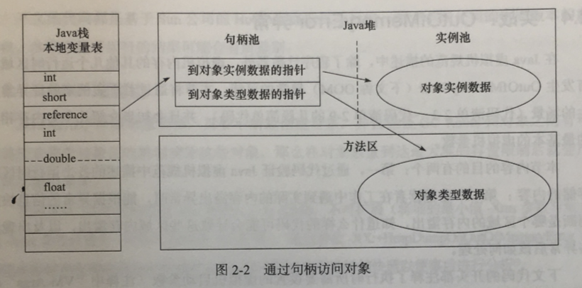

1. 直接指针访问

   > 如果使用直接指针访问，那么Java堆对象的布局中就必须考虑如何放置访问类型数据相关的信息，而reference中存储的直接就是对象地址。如下图：

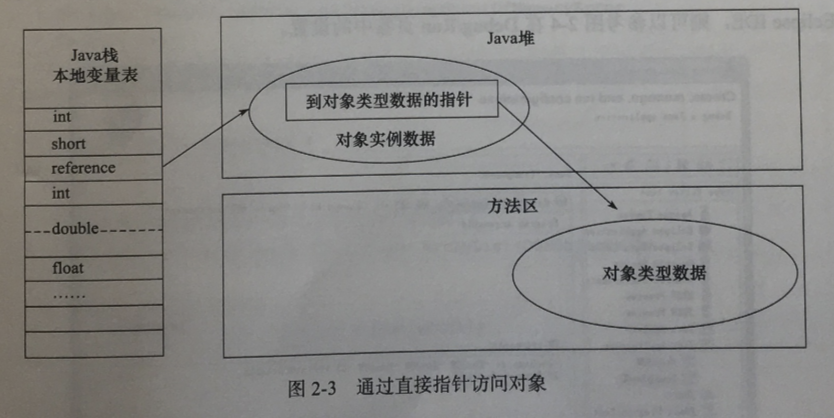

# 5 锁 

## **一：锁的状态**

锁的状态总共有四种：无锁状态、偏向锁、轻量级锁和重量级锁。随着锁的竞争，锁可以从偏向锁升级到轻量级锁，再升级的重量级锁（但是锁的升级是单向的，也就是说只能从低到高升级，不会出现锁的降级）。JDK 1.6中默认是开启偏向锁和轻量级锁的，我们也可以通过-XX:-UseBiasedLocking来禁用偏向锁。

 

1、轻量级锁的加锁过程

　　（1）在代码进入同步块的时候，如果同步对象锁状态为无锁状态（锁标志位为“01”状态，是否为偏向锁为“0”），虚拟机首先将在当前线程的栈帧中建立一个名为锁记录（Lock Record）的空间，用于存储锁对象目前的Mark Word的拷贝，官方称之为 Displaced Mark Word。这时候线程堆栈与对象头的状态如图2.1所示。

　　（2）拷贝对象头中的Mark Word复制到锁记录中。

　　（3）拷贝成功后，虚拟机将使用CAS操作尝试将对象的Mark Word更新为指向Lock Record的指针，并将Lock record里的owner指针指向object mark word。如果更新成功，则执行步骤（4），否则执行步骤（5）。

　　（4）如果这个更新动作成功了，那么这个线程就拥有了该对象的锁，并且对象Mark Word的锁标志位设置为“00”，即表示此对象处于轻量级锁定状态，这时候线程堆栈与对象头的状态如图2.2所示。

　　（5）如果这个更新操作失败了，虚拟机首先会检查对象的Mark Word是否指向当前线程的栈帧，如果是就说明当前线程已经拥有了这个对象的锁，那就可以直接进入同步块继续执行。否则说明多个线程竞争锁，轻量级锁就要膨胀为重量级锁，锁标志的状态值变为“10”，Mark Word中存储的就是指向重量级锁（互斥量）的指针，后面等待锁的线程也要进入阻塞状态。 而当前线程便尝试使用自旋来获取锁，自旋就是为了不让线程阻塞，而采用循环去获取锁的过程。

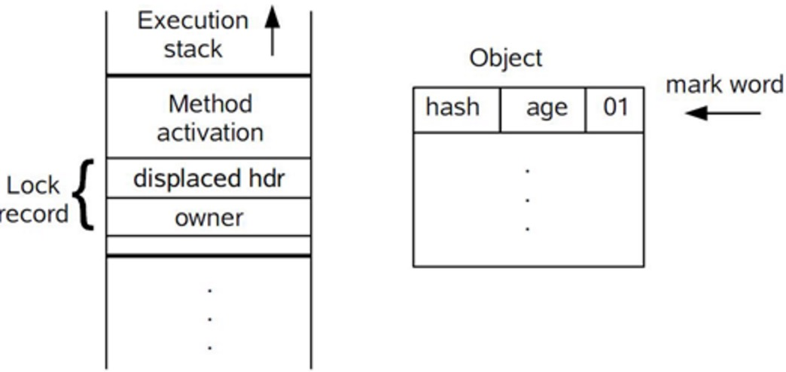

 

 图2.1 轻量级锁CAS操作之前堆栈与对象的状态

 


图2.2 轻量级锁CAS操作之后堆栈与对象的状态

 

 

**三、偏向锁**

​		“锁偏向是一种针对加锁操作的优化手段。它的核心思想是：如果一个线程获得了锁，那么锁就进入偏向模式。当这个线程再次请求锁时，无须再做任何同步操作。这样就节省了大量有关锁申请的操作，从而提高了程序性能。因此，对于几乎没有锁竞争的场合，偏向锁有比较好的优化效果，因为连续多次极有可能是同一个线程请求相同的锁。而对于锁竞争比较激烈的场合，其效果不佳。因为在竞争激烈的场合，最有可能的情况是每次都是不同的线程来请求相同的锁。这样偏向模式会失效，因此还不如不启用偏向锁”

　　引入偏向锁是为了在无多线程竞争的情况下尽量减少不必要的轻量级锁执行路径，因为轻量级锁的获取及释放依赖多次CAS原子指令，而偏向锁只需要在置换ThreadID的时候依赖一次CAS原子指令（由于一旦出现多线程竞争的情况就必须撤销偏向锁，所以偏向锁的撤销操作的性能损耗必须小于节省下来的CAS原子指令的性能消耗）。上面说过，轻量级锁是为了在线程交替执行同步块时提高性能，而偏向锁则是在只有一个线程执行同步块时进一步提高性能。

1、偏向锁获取过程：

　　（1）访问Mark Word中偏向锁的标识是否设置成1，锁标志位是否为01——确认为可偏向状态。

　　（2）如果为可偏向状态，则测试线程ID是否指向当前线程，如果是，进入步骤（5），否则进入步骤（3）。

　　（3）如果线程ID并未指向当前线程，则通过CAS操作竞争锁。如果竞争成功，则将Mark Word中线程ID设置为当前线程ID，然后执行（5）；如果竞争失败，执行（4）。

　　（4）如果CAS获取偏向锁失败，则表示有竞争。当到达全局安全点（safepoint）时获得偏向锁的线程被挂起，偏向锁升级为轻量级锁，然后被阻塞在安全点的线程继续往下执行同步代码。

　　（5）执行同步代码。

2、偏向锁的释放：

　　偏向锁的撤销在上述第四步骤中有提到。偏向锁只有遇到其他线程尝试竞争偏向锁时，持有偏向锁的线程才会释放锁，线程不会主动去释放偏向锁。偏向锁的撤销，需要等待全局安全点（在这个时间点上没有字节码正在执行），它会首先暂停拥有偏向锁的线程，判断锁对象是否处于被锁定状态，撤销偏向锁后恢复到未锁定（标志位为“01”）或轻量级锁（标志位为“00”）的状态。

3、重量级锁、轻量级锁和偏向锁之间转换

 


## 二 ：Java锁的分类

网上关于Java中锁的话题可以说资料相当丰富，但相关内容总感觉是一大串术语的罗列，让人云里雾里，读完就忘。本文希望能为Java新人做一篇通俗易懂的整合，旨在消除对各种各样锁的术语的恐惧感，对每种锁的底层实现浅尝辄止，但是在需要时能够知道去查什么。

首先要打消一种想法，就是一个锁只能属于一种分类。其实并不是这样，比如一个锁可以同时是悲观锁、可重入锁、公平锁、可中断锁等等，就像一个人可以是男人、医生、健身爱好者、游戏玩家，这并不矛盾。OK，国际惯例，上干货。

### 〇、synchronized与Lock

Java中有两种加锁的方式：一种是用**synchronized关键字**，另一种是用**Lock接口**的实现类。

形象地说，synchronized关键字是**自动档**，可以满足一切日常驾驶需求。但是如果你想要玩漂移或者各种骚操作，就需要**手动档**了——各种Lock的实现类。

所以如果你只是想要简单的加个锁，对性能也没什么特别的要求，用synchronized关键字就足够了。自Java 5之后，才在java.util.concurrent.locks包下有了另外一种方式来实现锁，那就是Lock。也就是说，**synchronized是Java语言内置的关键字，而Lock是一个接口**，这个接口的实现类在代码层面实现了锁的功能，具体细节不在本文展开，有兴趣可以研究下AbstractQueuedSynchronizer类，写得可以说是牛逼爆了。

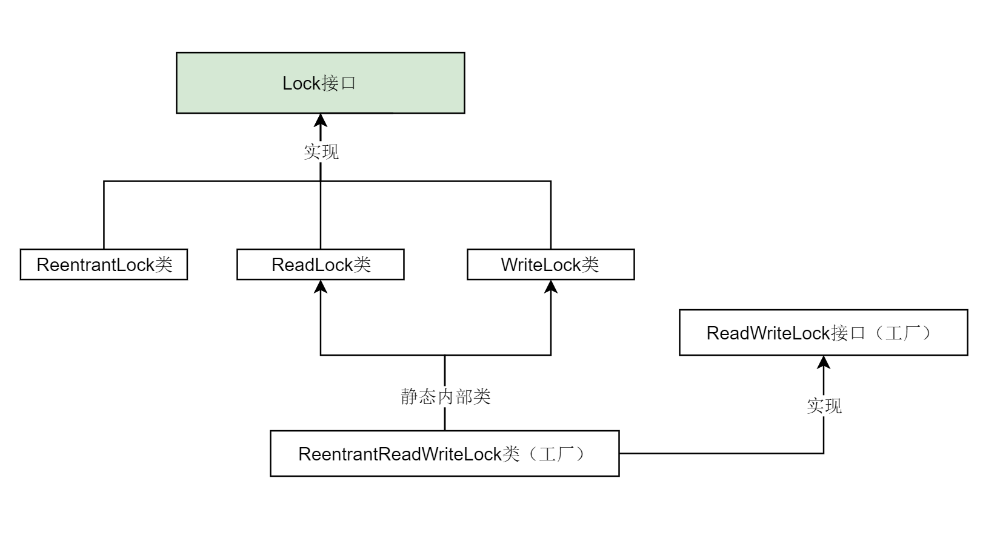其实只需要关注三个类就可以了：ReentrantLock类、ReadLock类、WriteLock类。

**ReentrantLock、ReadLock、WriteLock** 是Lock接口最重要的三个实现类。对应了“可重入锁”、“读锁”和“写锁”，后面会讲它们的用途。

ReadWriteLock其实是一个工厂接口，而ReentrantReadWriteLock是ReadWriteLock的实现类，它包含两个静态内部类ReadLock和WriteLock。这两个静态内部类又分别实现了Lock接口。

我们停止深究源码，仅从使用的角度看，Lock与synchronized的区别是什么？在接下来的几个小节中，我将梳理各种锁分类的概念，以及synchronized关键字、各种Lock实现类之间的区别与联系。

### 一、悲观锁与乐观锁

锁的一种宏观分类方式是**悲观锁**和**乐观锁**。悲观锁与乐观锁**并不是特指某个锁**（Java中没有哪个Lock实现类就叫PessimisticLock或OptimisticLock），而是在并发情况下的两种不同策略。

悲观锁（Pessimistic Lock）, 就是很悲观，每次去拿数据的时候都认为别人会修改。所以每次在拿数据的时候都会上锁。这样别人想拿数据就被挡住，直到悲观锁被释放。

乐观锁（Optimistic Lock）, 就是很乐观，每次去拿数据的时候都认为别人不会修改。所以**不会上锁，不会上锁！**但是如果想要更新数据，则会在**更新前检查在读取至更新这段时间别人有没有修改过这个数据**。如果修改过，则重新读取，再次尝试更新，循环上述步骤直到更新成功（当然也允许更新失败的线程放弃操作）。

**悲观锁阻塞事务，乐观锁回滚重试**，它们各有优缺点，不要认为一种一定好于另一种。像乐观锁适用于写比较少的情况下，即冲突真的很少发生的时候，这样可以省去锁的开销，加大了系统的整个吞吐量。但如果经常产生冲突，上层应用会不断的进行重试，这样反倒是降低了性能，所以这种情况下用悲观锁就比较合适。

### 二、乐观锁的基础——CAS

说到乐观锁，就必须提到一个概念：**CAS**

什么是CAS呢？Compare-and-Swap，即**比较并替换，**也有叫做Compare-and-Set的，**比较并设置**。

1、比较：读取到了一个值A，在将其更新为B之前，检查原值是否仍为A（未被其他线程改动）。

2、设置：如果是，将A更新为B，结束。[[1\]](https://zhuanlan.zhihu.com/p/71156910#ref_1)如果不是，则什么都不做。

上面的两步操作是原子性的，可以简单地理解为瞬间完成，在CPU看来就是一步操作。

有了CAS，就可以实现一个**乐观锁**：

```c
data = 123; // 共享数据

/* 更新数据的线程会进行如下操作 */
flag = true;
while (flag) {
    oldValue = data; // 保存原始数据
    newValue = doSomething(oldValue); 

    // 下面的部分为CAS操作，尝试更新data的值
    if (data == oldValue) { // 比较
        data = newValue; // 设置
        flag = false; // 结束
    } else {
	// 啥也不干，循环重试
    }
}
/* 
   很明显，这样的代码根本不是原子性的，
   因为真正的CAS利用了CPU指令，
   这里只是为了展示执行流程，本意是一样的。
*/
```

这是一个简单直观的乐观锁实现，它允许多个线程同时读取（因为根本没有加锁操作），但是只有一个线程可以成功更新数据，并导致其他要更新数据的线程回滚重试。 CAS利用CPU指令，从硬件层面保证了操作的原子性，以达到类似于锁的效果。

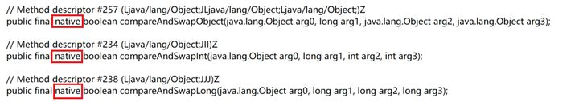Java中真正的CAS操作调用的native方法

因为整个过程中并没有“加锁”和“解锁”操作，因此乐观锁策略也被称为**无锁编程**。换句话说，乐观锁其实不是“锁”，它仅仅是一个循环重试CAS的算法而已！

### 三、自旋锁

有一种锁叫**自旋锁**。所谓自旋，说白了就是一个 while(true) 无限循环。

刚刚的乐观锁就有类似的无限循环操作，那么它是自旋锁吗？

> 感谢评论区[养猫的虾](https://www.zhihu.com/people/zhao-chen-77-90)的指正。

不是。尽管自旋与 while(true) 的操作是一样的，但还是应该将这两个术语分开。“自旋”这两个字，特指自旋锁的自旋。

然而在JDK中并没有自旋锁（SpinLock）这个类，那什么才是自旋锁呢？读完下个小节就知道了。

### 四、synchronized锁升级：偏向锁 → 轻量级锁 → 重量级锁

前面提到，synchronized关键字就像是汽车的**自动档，**现在详细讲这个过程。一脚油门踩下去，synchronized会从**无锁**升级为**偏向锁**，再升级为**轻量级锁**，最后升级为**重量级锁**，就像自动换挡一样。那么自旋锁在哪里呢？这里的轻量级锁就是一种**自旋锁**。

初次执行到synchronized代码块的时候，锁对象变成**偏向锁**（通过CAS修改对象头里的锁标志位），字面意思是“偏向于第一个获得它的线程”的锁。执行完同步代码块后，线程并**不会主动释放偏向锁**。当第二次到达同步代码块时，线程会判断此时持有锁的线程是否就是自己（持有锁的线程ID也在对象头里），如果是则正常往下执行。**由于之前没有释放锁，这里也就不需要重新加锁。**如果自始至终使用锁的线程只有一个，很明显偏向锁几乎没有额外开销，性能极高。

一旦有第二个线程加入**锁竞争**，偏向锁就升级为**轻量级锁（自旋锁）**。这里要明确一下什么是锁竞争：如果多个线程轮流获取一个锁，但是每次获取锁的时候都很顺利，没有发生阻塞，那么就不存在锁竞争。只有当某线程尝试获取锁的时候，发现该锁已经被占用，只能等待其释放，这才发生了锁竞争。

在轻量级锁状态下继续锁竞争，没有抢到锁的线程将**自旋**，即不停地循环判断锁是否能够被成功获取。获取锁的操作，其实就是通过CAS修改对象头里的锁标志位。先**比较**当前锁标志位是否为“释放”，如果是则将其**设置**为“锁定”，比较并设置是**原子性**发生的。这就算抢到锁了，然后线程将当前锁的持有者信息修改为自己。

长时间的自旋操作是非常消耗资源的，一个线程持有锁，其他线程就只能在原地空耗CPU，执行不了任何有效的任务，这种现象叫做**忙等（busy-waiting）**。如果多个线程用一个锁，但是没有发生锁竞争，或者发生了很轻微的锁竞争，那么synchronized就用轻量级锁，允许短时间的忙等现象。这是一种折衷的想法，**短时间的忙等，换取线程在用户态和内核态之间切换的开销。**

显然，此忙等是有限度的（有个计数器记录自旋次数，默认允许循环10次，可以通过虚拟机参数更改）。如果锁竞争情况严重，某个达到最大自旋次数的线程，会将轻量级锁升级为**重量级锁**（依然是CAS修改锁标志位，但不修改持有锁的线程ID）。当后续线程尝试获取锁时，发现被占用的锁是重量级锁，则直接将自己挂起（而不是忙等），等待将来被唤醒。在JDK1.6之前，synchronized直接加重量级锁，很明显现在得到了很好的优化。

一个锁只能按照 偏向锁、轻量级锁、重量级锁的顺序逐渐升级（也有叫**锁膨胀**的），不允许降级。

> 感谢评论区[酷帅俊靓美](https://www.zhihu.com/people/ding-yi-51-99)的问题：
> 偏向锁的一个特性是，持有锁的线程在执行完同步代码块时不会释放锁。那么当第二个线程执行到这个synchronized代码块时是否一定会发生锁竞争然后升级为轻量级锁呢？
> 线程A第一次执行完同步代码块后，当线程B尝试获取锁的时候，发现是偏向锁，会判断线程A是否仍然存活。**如果线程A仍然存活，**将线程A暂停，此时偏向锁升级为轻量级锁，之后线程A继续执行，线程B自旋。但是**如果判断结果是线程A不存在了**，则线程B持有此偏向锁，锁不升级。
> 还有人对此有疑惑，我之前确实没有描述清楚，但如果要展开讲，涉及到太多新概念，可以新开一篇了。更何况有些太底层的东西，我没读过源码，没有自信说自己一定是对的。其实在升级为轻量级锁之前，虚拟机会让线程A尽快在安全点挂起，然后在它的栈中“伪造”一些信息，让线程A在被唤醒之后，认为自己一直持有的是轻量级锁。如果线程A之前正在同步代码块中，那么线程B自旋等待即可。如果线程A之前不在同步代码块中，它会在被唤醒后检查到这一情况并立即释放锁，让线程B可以拿到。这部分内容我之前也没有深入研究过，如果有说的不对的，请多多指教啊！

### 五、可重入锁（递归锁）

可重入锁的字面意思是“可以重新进入的锁”，即**允许同一个线程多次获取同一把锁**。比如一个递归函数里有加锁操作，递归过程中这个锁会阻塞自己吗？如果不会，那么这个锁就是**可重入锁**（因为这个原因可重入锁也叫做**递归锁**）**。**

Java里只要以Reentrant开头命名的锁都是可重入锁，而且**JDK提供的所有现成的Lock实现类，包括synchronized关键字锁都是可重入的。**如果你需要不可重入锁，只能自己去实现了。网上不可重入锁的实现真的很多，就不在这里贴代码了。99%的业务场景用可重入锁就可以了，剩下的1%是什么呢？我也不知道，谁可以在评论里告诉我？

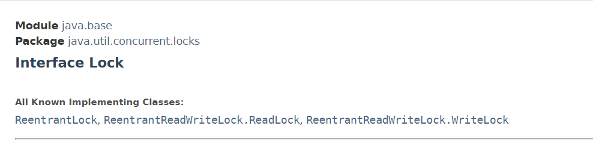JDK提供的Lock的实现类都是可重入的

### 六、公平锁、非公平锁

如果多个线程申请一把**公平锁**，那么当锁释放的时候，先申请的先得到，非常公平。显然如果是**非公平锁**，后申请的线程可能先获取到锁，是随机或者按照其他优先级排序的。

对ReentrantLock类而言，通过构造函数传参**可以指定该锁是否是公平锁，默认是非公平锁**。一般情况下，非公平锁的吞吐量比公平锁大，如果没有特殊要求，优先使用非公平锁。

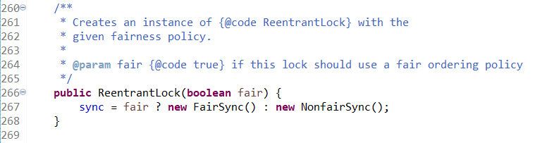ReentrantLock构造器可以指定为公平或非公平

对于synchronized而言，它也是一种**非公平锁**，但是并没有任何办法使其变成公平锁。

### 七、可中断锁

可中断锁，字面意思是“可以**响应中断**的锁”。

这里的关键是理解什么是**中断**。Java并没有提供任何直接中断某线程的方法，只提供了**中断机制**。何谓“中断机制”？线程A向线程B发出“请你停止运行”的请求（线程B也可以自己给自己发送此请求），但线程B并不会立刻停止运行，而是自行选择合适的时机以自己的方式响应中断，也可以直接忽略此中断。也就是说，Java的**中断不能直接终止线程**，而是需要被中断的线程自己决定怎么处理。这好比是父母叮嘱在外的子女要注意身体，但子女是否注意身体，怎么注意身体则完全取决于自己。[[2\]](https://zhuanlan.zhihu.com/p/71156910#ref_2)

回到锁的话题上来，如果线程A持有锁，线程B等待获取该锁。由于线程A持有锁的时间过长，线程B不想继续等待了，我们可以让线程B中断自己或者在别的线程里中断它，这种就是**可中断锁**。

在Java中，synchronized就是**不可中断锁**，而Lock的实现类都是**可中断锁，**可以简单看下Lock接口。

```java
/* Lock接口 */
public interface Lock {

    void lock(); // 拿不到锁就一直等，拿到马上返回。

    void lockInterruptibly() throws InterruptedException; // 拿不到锁就一直等，如果等待时收到中断请求，则需要处理InterruptedException。

    boolean tryLock(); // 无论拿不拿得到锁，都马上返回。拿到返回true，拿不到返回false。

    boolean tryLock(long time, TimeUnit unit) throws InterruptedException; // 同上，可以自定义等待的时间。

    void unlock();

    Condition newCondition();
}
```

### 八、读写锁、共享锁、互斥锁

读写锁其实是一对锁，一个读锁（共享锁）和一个写锁（互斥锁、排他锁）。

看下Java里的ReadWriteLock接口，它只规定了两个方法，一个返回读锁，一个返回写锁。

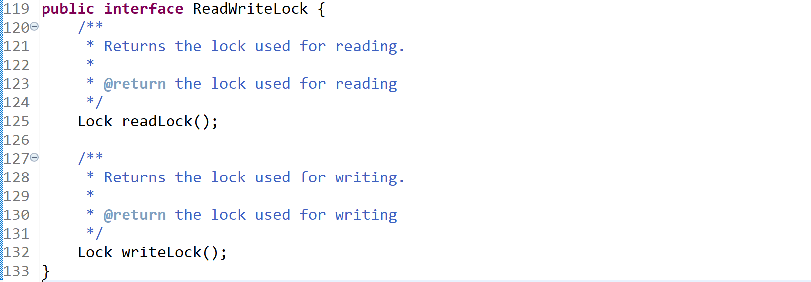

记得之前的乐观锁策略吗？所有线程随时都可以读，仅在写之前判断值有没有被更改。

读写锁其实做的事情是一样的，但是策略稍有不同。很多情况下，线程知道自己读取数据后，是否是为了更新它。那么何不在加锁的时候直接明确这一点呢？如果我读取值是为了更新它（SQL的for update就是这个意思），那么加锁的时候就直接加**写锁**，我持有写锁的时候别的线程无论读还是写都需要等待；如果我读取数据仅为了前端展示，那么加锁时就明确地加一个**读锁，**其他线程如果也要加读锁，不需要等待，可以直接获取（读锁计数器+1）。

虽然读写锁感觉与乐观锁有点像，但是**读写锁是悲观锁策略**。因为读写锁并没有在**更新前**判断值有没有被修改过，而是在**加锁前**决定应该用读锁还是写锁。乐观锁特指无锁编程，如果仍有疑惑可以再回到第一、二小节，看一下什么是“乐观锁”。

JDK提供的唯一一个ReadWriteLock接口实现类是ReentrantReadWriteLock。看名字就知道，它不仅提供了读写锁，而是都是可重入锁。 除了两个接口方法以外，ReentrantReadWriteLock还提供了一些便于外界监控其内部工作状态的方法，这里就不一一展开。

### 九、回到悲观锁和乐观锁

> 这篇文章经历过一次修改，我之前认为偏向锁和轻量级锁是乐观锁，重量级锁和Lock实现类为悲观锁，网上很多资料对这些概念的表述也很模糊，各执一词。

先抛出我的结论：

我们在Java里使用的各种锁，**几乎全都是悲观锁**。synchronized从偏向锁、轻量级锁到重量级锁，全是悲观锁。JDK提供的Lock实现类全是悲观锁。其实只要有“锁对象”出现，那么就一定是悲观锁。因为**乐观锁不是锁，而是一个在循环里尝试CAS的算法。**

那JDK并发包里到底有没有乐观锁呢？

有。java.util.concurrent.atomic包里面的**原子类**都是利用乐观锁实现的。

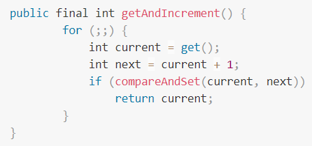原子类AtomicInteger的自增方法为乐观锁策略

为什么网上有些资料认为偏向锁、轻量级锁是乐观锁？理由是它们底层用到了CAS？或者是把“乐观/悲观”与“轻量/重量”搞混了？其实，线程在抢占这些锁的时候，确实是循环+CAS的操作，感觉好像是乐观锁。但问题的关键是，我们说一个锁是悲观锁还是乐观锁，总是应该站在应用层，看它们是如何锁住应用数据的，而不是站在底层看抢占锁的过程。如果一个线程尝试获取锁时，发现已经被占用，它是否继续读取数据，等后续要更新时再决定要不要重试？对于偏向锁、轻量级锁来说，显然答案是否定的。无论是挂起还是忙等，对应用数据的读取操作都被“挡住”了。从这个角度看，它们确实是悲观锁。

# 6 volatile

## 可见性原理

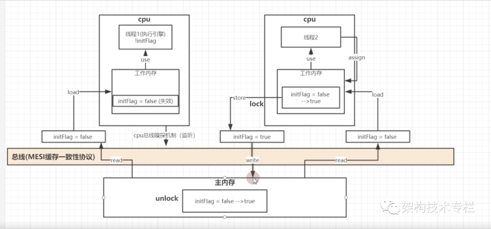img

看图说话

**关键点1：** 总线嗅探器（MESI 缓存一致性原理 ）

**关键点2：** 总线锁、缓存锁，为了解决并发问题，会在内存区域的值加锁（内存锁），是在store 之前会给总线内的值加一个锁，write 完成后在解锁（这里大部分是缓存行锁的，总线锁看情况）。

**关键点3：**

就是为了使一个CPU上运行的线程能够读取到另外一个CPU线程的共享变量更新。这个CPU必须先根据无效化队列中存储的消息，删除相应高速缓存内的数据副本，从而在其他CPU更新共享变量时能通过缓存一致性协议同步到该CPU的高速缓存中。内存屏障中的加载屏障 （Load Barrier）就是用来解决这个问题的。Load Barrier会根据会根据无效化队列内容的内存地址，将其他CPU上使用了该缓存的高速缓存中对应的数据状态标记为I，从而使用该CPU后续针对这个的读操作时必须先发送Read消息，以将其他处理器对相关共享变量所做的更新同步到该处理器的高速缓存中。

**总结：**

当修改了增加volatile 的变量时，会马上将变量值写回到主内存中，这时会在store 前对主内存的这个变量加锁，在store 通过总线的时候触发MESI缓存一致性协议，通过总线嗅探器将其他cpu工作内存中的此变量置为无效状态（涉及内存屏障）。当次cpu 完成变量的write 操作时，在对变量进行解锁。


synchronized 与CAS 在cpu底层是使用 lock：cmpxchg实现

## 内存屏障

1 jvm 层面

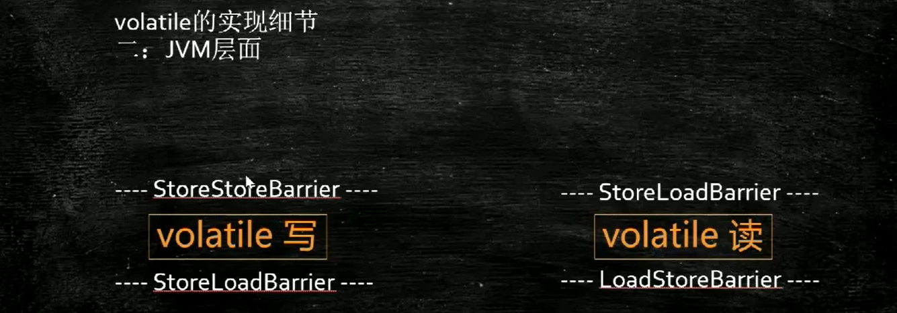

2 cpu 层面

​	os::is_MP()  判断系统是否是多cpu

​	使用lock; addl 加锁

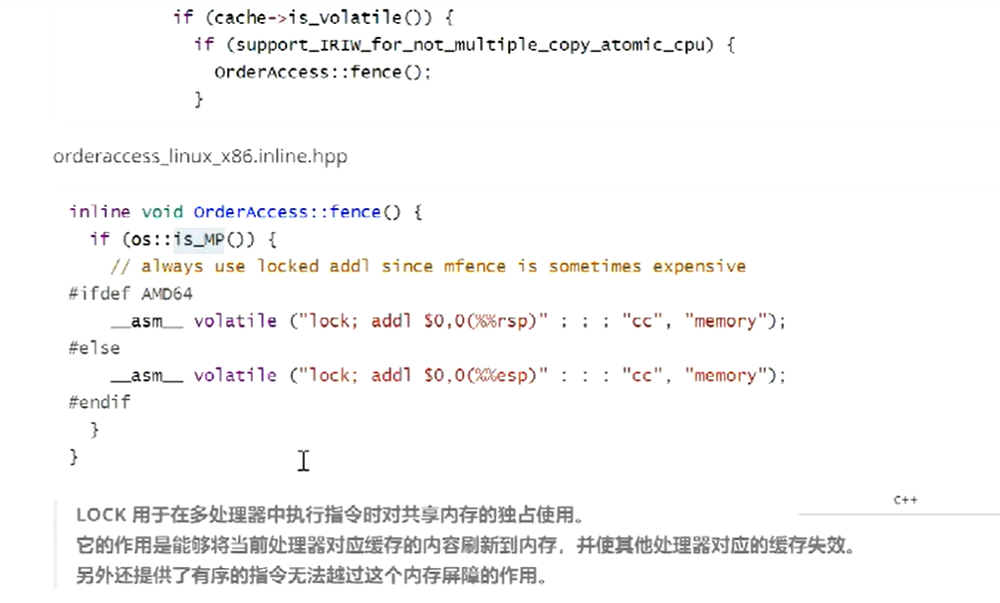