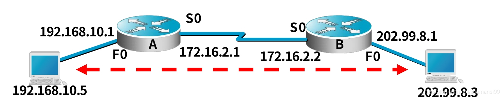
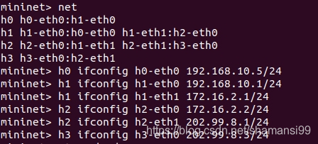
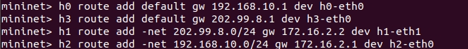
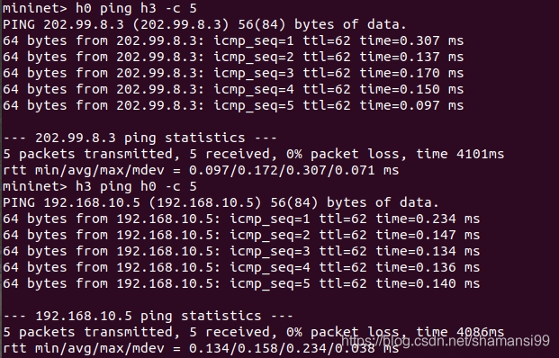

## 启动onos

cd onos/

op

ok

未编译版本：

cd onos/bin

./onos-server clean >/dev/null $

启动onos，丢掉输出，放在后台

#### 进入onosUI界面

http://localhost:8181/onos/ui/

预设的用户名称：onos
预设的用户密码：rocks

#### 进入cli

onos localhost

app activate zy

app deactivate zy

在文件目录下安装应用

onos-app localhost reinstall onos-apps-zy-oar.oar

未编译版本：

cd onos/bin 

./onos

## mininet

创建topo

sudo mn --topo=tree,3,2 --controller remote

使用脚本

```python
# sudo mn --custom 2s_8h.py --topo mytopo  --controller=remote,ip=211.69.197.92,port=6653 --mac
from mininet.node import DockerOVS, Docker, RemoteController
from mininet.log import setLogLevel
from mininet.examples.clustercli import ClusterCLI as CLI
from mininet.topo import Topo
from mininet.net import Mininet
from mininet.link import TCLink
 
class MyTopo( Topo ):
 
    def __init__( self ):
 
        # initilaize topology   
        Topo.__init__( self )
 
        # add hosts and switches
        h1 = self.addHost( 'h1' )
        h2 = self.addHost( 'h2' )
        h3 = self.addHost( 'h3' )
        s1 = self.addSwitch( 's1' )
        s2 = self.addSwitch( 's2' )
 
        # add links
        self.addLink(h1,s1,1,1,bw=0.5,delay='10ms',loss=0.2)
        self.addLink(h2,s1,1,3,bw=0.5,delay='10ms',loss=0.2)
        self.addLink(h3,s2,1,1,bw=0.5,delay='10ms',loss=0.2)
        self.addLink(s1,s2,2,2,bw=0.5,delay='10ms',loss=0.2)
 
topos = { 'mytopo': ( lambda: MyTopo() ) }
```

​     h1--------      s1------------s2

​                           |                 |

​                           h2                 h3


test2.py

```python
from mininet.node import DockerOVS, Docker, RemoteController
from mininet.log import setLogLevel
from mininet.examples.clustercli import ClusterCLI as CLI
from mininet.topo import Topo
from mininet.net import Mininet
from mininet.link import TCLink


class MyTopo( Topo ):
 
    def __init__( self ):
 
        # initilaize topology   
        Topo.__init__( self )
 
        # add hosts and switches
        h1 = self.addHost( 'h1' )
        h2 = self.addHost( 'h2' )
        h3 = self.addHost( 'h3' )
        s1 = self.addSwitch( 's1' )
        s2 = self.addSwitch( 's2' )
 
        # add links
        self.addLink(h1,s1,1,1,bw=0.5,delay='10ms',loss=0.2)
        self.addLink(h2,s1,1,3,bw=0.5,delay='10ms',loss=0.2)
        self.addLink(h3,s2,1,1,bw=0.5,delay='10ms',loss=0.2)
        self.addLink(s1,s2,2,2,bw=0.5,delay='10ms',loss=0.2)

def start_topo():
   
    topo = Mytopo()
    link = TCLink
    net = Mininet(topo=topo, link=link,
                  controller=RemoteController(name='c', ip='127.0.0.1', port=6633))
    net.start()

    net.pingAll()

    # for test
    CLI(net)
    net.stop()
    # return topo.structure


if __name__ == '__main__':
    start_topo()

    
    
cd mininet/mininet/examples
sudo python test2.py
```


利用mininet构建下面的拓扑，并测试能否ping通：



路由器会自动生成本路由器激活端口所在网段的路由条目，即直接路由，因此要让两主机之间能ping通，只要造A, B中分别添加静态路由即可 (当然还要在两主机之间添加默认路由)。
上述拓扑的代码如下 (构建四个主机h0, h1, h2, h3, 最后其中h1, h2作为路由器) ：

```python
#!/usr/bin/python

from mininet.net import Mininet
from mininet.node import Controller, RemoteController
from mininet.cli import CLI
from mininet.log import setLogLevel, info
from mininet.link import Link, TCLink
from mininet.topo import Topo
import logging
import os

class HostTopo(Topo):

    def create_nodes(self, length):
        for i in range(0, length):
            self.host_list.append(self.addHost('h' + str(i)))

    def create_links(self, length):
        for i in range(0, length-1):
            self.addLink(self.host_list[i], self.host_list[i+1])

    def __init__(self, length):
        logger.debug("Class SimpleTopo init")
        self.host_list = []
        Topo.__init__(self)

        self.create_nodes(length)
        self.create_links(length)

def create_topo(length):
    topo = HostTopo(length)
    net = Mininet(topo = topo, link = TCLink, controller = None)
    net.start()
    CLI(net)
    net.stop()

if __name__ == '__main__':
    logger = logging.getLogger(__name__)
    setLogLevel('info')
    if os.getuid() != 0:
        logger.debug("You are NOT root")
    elif os.getuid() == 0:
        create_topo(4)
        

```

​        

先给每个接口配置相应的IP地址：



h1 ifconfig h1-eth0 192.168.1.1 netmask 255.255.255.0
 h2 ifconfig h2-eth0 192.168.1.2 netmask 255.255.255.0
 h3 ifconfig h3-eth0 192.168.2.1 netmask 255.255.255.0
 h4 ifconfig h4-eth0 192.168.2.2 netmask 255.255.255.0

添加路由：



dev interface, interface是指本路由器 (不是相连的另一个路由器) 转发分组所用的接口，gw Getway, Getway是指相连的另一个路由器的接口IP地址。

接下来给h1, h2启动ipv4转发功能：


测试h0 -> h3, h3 -> h0：



测试成功。

小结
1 . 直接路由在给接口分配IP地址的时候就自动生成直连路由了，静态路由需要手动配置。
2 . 添加路由的时候，interface, Getway 指代的对象要清楚。