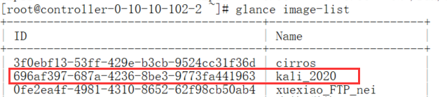

1. 打开虚拟机（202.117.15.111）

```
cd ~/etps/openstack/images

sudo virt-install \
--virt-type kvm \dcd 
--name vm \
--ram 2048 \
--vcpus 1 \
--boot hd \
--disk ubuntu18-ovx-sdnip-onos-0914.img,bus=virtio,size=20,format=qcow2 \  # 要修改的vm
--network network=default \
--graphics vnc,listen=0.0.0.0 \
--os-type=linux --os-variant=ubuntu18.04
```

2. 更新虚拟机

```

docker pull neptune15/host_iperf:v4
docker pull neptune15/ovx:v4.3

cd ~/etps/dataplane/ovx/scripts/
rm embedder.py
vi embedder.py
cd ~/etps/dataplane/ovx/scripts/src/algorithms/
rm my_final_algorithm.py
vi my_final_algorithm.py

cd ~/etps/dataplane/ovx/

docker build -t neptune15/ovx:v4 .

```


3. 关机

```
sudo shutdown -h now
sudo virsh undefine vm
```

4. 上传到openstack服务器（:）

```
sftp 192.168.31.20
put xxx.img
```

5. 加载到openstack

```
ssh test@192.168.31.20

. /etc/kolla/admin-openrc.sh

openstack image list
openstack server list  # 删除正在使用旧镜像的server

# 删除旧镜像
openstack image delete ubuntu18

# 上传新镜像
openstack image create \
--disk-format=qcow2 \
--container-format=bare \
--file=xxx.img \  # 上传的镜像
ubuntu18
openstack image create \
--disk-format=qcow2 \
--container-format=bare \
--file=ubuntu1811.img \  
ubuntu18.1.1
```

下载镜像

1 进入opensttack 服务器

ssh test@192.168.31.20

2 列出所有镜像

glance image-list



3 下载

glance image-download --file ./kali_2020.qcow2 696af397-687a-4236-8be3-9773fa441963


window

转换镜像格式。

1. 在“cmd”窗口输入如下命令切换文件目录，以安装目录为“D:\Program Files\qemu”为例。

   **d:**

   **cd** **D:\qemu**

1. 执行如下命令转换镜像文件格式，以转换vmdk格式为qcow2格式的镜像为例。

   **qemu-img** **convert** **-p** **-f** **vmdk** **-O** **qcow2** **centos6.9.vmdk** **centos6.9.qcow2**

   上述命令中各参数对应的说明如下：

   - -p：表示镜像转换的进度。
   - -f后面为源镜像格式。
   - -O（必须是大写）后面的参数由如下3个部分组成：转换出来的镜像格式 + 源镜像文件名称 + 目标文件名称。

   转换完成后，目标文件会出现在源镜像文件所在的目录下。

   回显信息如下所示：

   ```
   # qemu-img convert -p -f vmdk -O qcow2 centos6.9.vmdk centos6.9.qcow2
       (100.00/100%)
   ```