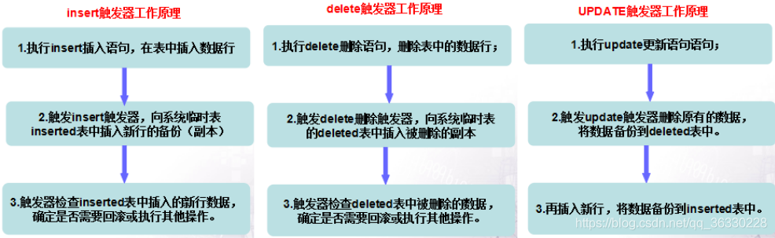
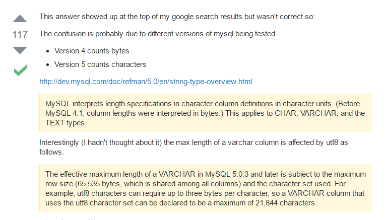

### 1.http和https区别  

### 2.linux常见的命令(压缩和解压缩，创建文件  

### 3.delete和t区别  

### 4.tcp和udp区别  

### 5.线程间通信方式  

### 6.什么是线程间的通信  

### 7.线程和进程区别  

### 8.触发器  

触发器（trigger）是SQL server 提供给程序员和数据分析员来保证数据完整性的一种方法，它是与表事件相关的特殊的存储过程，它的执行不是由程序调用，也不是手工启动，而是由事件来触发，比如当对一个表进行操作（ insert，delete， update）时就会激活它执行。触发器经常用于加强数据的完整性约束和业务规则等。

### 9.索引创建的规则  

### 10.cookie和session区别  

### 11.线程有哪几种状态  

### 12.说出5种[排序]()[算法]()   

​    

###      下面给出我了解到的其他组的问题    

### 1.什么是缓存？    

### 2.写出三种缓存策略    

### 3.缓存会导致什么问题？    

### 4.幻读    

### 5.泊松分布中lambda参数是什么含义？    

### 6.[二叉树]()层次遍历用到的数据结构是什么？    

### 7.说出5种[排序]()[算法]()    

### 8.[二叉树]()有几种遍历[算法]()，时间复杂度是多少？    

### 9.在网页地址栏输入网址，按回车之后都完成了哪些过程    

### 10.进程和线程的区别    

### 11.tcp和udp的区别    

### 12.数据库连接是tcp的还是udp的                                        

​          jdbc默认为tcp

### 13.数据库char和varchar的区别    

#### 区别一：定长与变长

在MySQL中，char和varchar都是用来存储字符串的，区别在于char有固定的长度，而varchar属于可变长的字符类型。
char有固定的的长度，所以在处理速度上要比varchar快很多，但是也相对更耗费存储空间，在速度上有要求的可以使用char类型。

- char类型是规定多少字长则必须存储多少字长，超过的字段则只能截取出对应的长度进行存储，相对于要去字长长度不够的字段则用空格补齐。
- varchar类型则是只要在规定字长之内，有多少就存多少，无需补齐；超出部分和char一样，舍去即可。（由prefix实现）

#### 区别二：存储容量不同

- 对于char类型来说，最多只能存放的字符个数为255，和编码无关。
- varchar最多能存放65532个字符，varchar的最大有效长度由最大行大小和使用的字符集来确定，整体最大长度是65532个字符。

#### varchar(1)占用几个字节

首先要考虑一下varchar的长度是按字节来算还是按字符来算。查阅了一下网上的答案：

也就是：
在version4之前，MySQL中varchar长度是按字节；而version5之后，按字符。如varchar(6),在version4，表示占用6个字节，而在version5中，表示占用6个字符。

而字符和字节的换算，则与编码方式有关，不同的字符所占的字节是不同的。：

- ASCII码：
  一个英文字母（不分大小写）占一个字节的空间，一个中文汉字占两个字节的空间。一个二进制数字序列，在计算机中作为一个数字单元，一般为8位二进制数，换算为十进制。最小值0，最大值255。如一个ASCII码就是一个字节。
- UTF-8编码：
  一个英文字符等于一个字节，一个中文（含繁体）等于三个字节。
- Unicode编码：
  一个英文等于两个字节，一个中文（含繁体）等于两个字节。

### 14.说一下数据库的隔离级别。    

### 15.[二叉树]()有几种遍历[算法]()，时间复杂度是多少？    

### 16.不稳定性是啥？快排是稳定的吗，为什么不稳定    

### 17.索引和插件的区别    

### 18.进程间通信    

### 19.如何创建线程    

### 20.sql攻击    

### 21.spring boot的优势    

### 22.springboot和springcloud    

###  23.DML DDL    

### 24.删除数据的方式    

### 25.集合有哪几种    

### 26.异常机制    

### 27.回收机制    

### 28.string Arraylist    