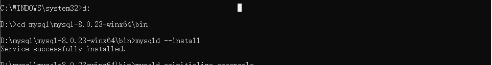
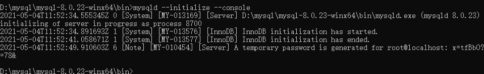
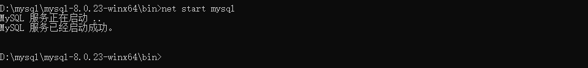
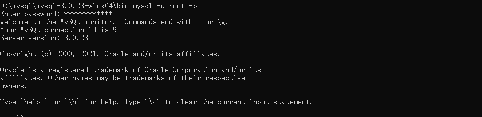
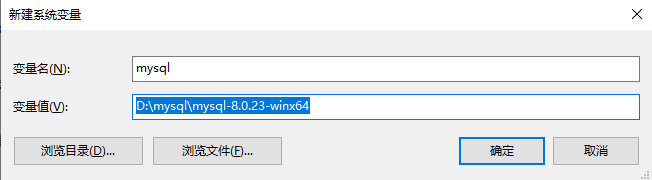
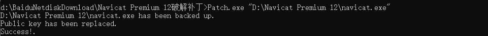
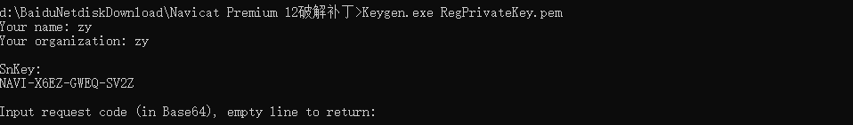
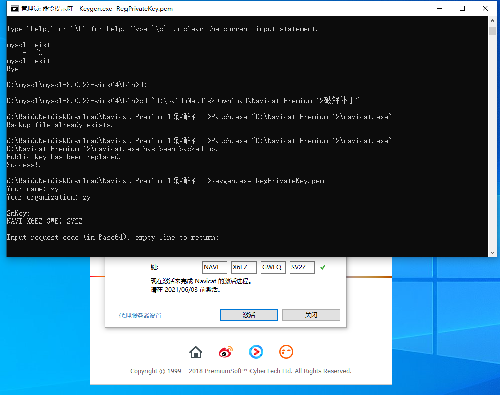
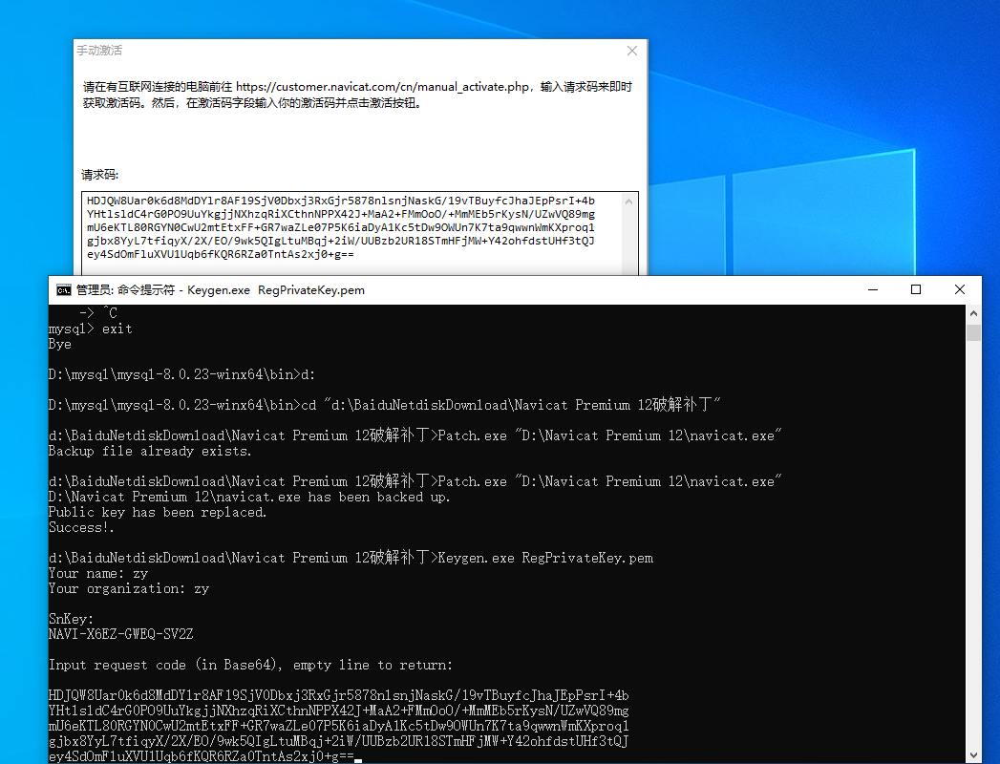
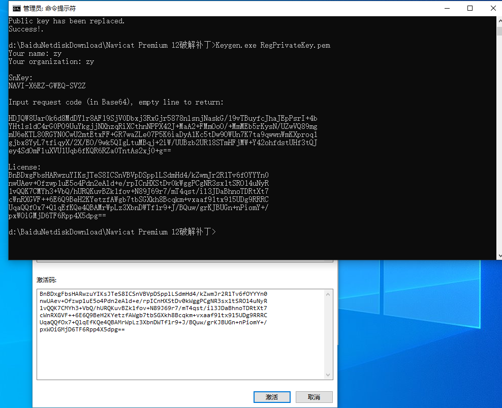

400服务器

202.117.15.93

root

root.400

IP：202.117.15.111

账号：test

密码：875574485

进入项目文件夹： cd etps/backend/new_server/mw_server4/

启动项目服务器：python3 server_forTest.py

## 在线安装TensorFlow环境

bash Anaconda3-5.2.0-Linux-x86_64.sh 

export PATH=~/anaconda3/bin:$PATH   // 

conda create -n tensorflow python=3.6

source activate tensorflow

conda install  tensorflow=1.5.0

conda install keras=2.1.3

conda install scikit-learn=0.19

conda install pandas

conda install matplotlib

conda install pydot

在tensorflow空间中,进入文件夹

1.训练数据

python train.py --model lstm

2.test

python3 main.py

## 离线安装anaconda与TensorFlow

bash Anaconda3-5.2.0-Linux-x86_64.sh 

export PATH=~/anaconda3/bin:$PATH

echo 'export PATH="/home/fangzhen/anaconda3/bin:$PATH"' >> ~/.bashrc

source ~/.bashrc

将env 与pkts 解压缩

## 安装MySQL

1 下载地址https://downloads.mysql.com/archives/community/

2 安装mysql的服务：mysqld --install

​                    

3 初始化mysql，在这里，初始化会产生一个随机密码,如下图框框所示，记住这个密码，后面会用到(mysqld --initialize --console)

4 开启mysql的服务(net start mysql)

5 登录验证，mysql是否安装成功！

6 修改密码  alter user 'root'@'localhost' indentified by 'root';

7 设置全局变量

加入Path路径中

8 在mysql目录下创建一个ini或cnf配置文件

9 更改加密规则

 ALTER USER'root'@'localhost' IDENTIFIED BY 'root' PASSWORD EXPIRE NEVER;

 ALTER USER 'root'@'localhost' IDENTIFIED WITH mysql_native_password BY 'root';

 FLUSH PRIVILEGES; 

## Navicat Premium 12 破解

1 首先使用cd命令切换到当前Navicat Premium 12破解补丁文件夹位置

2 然后用*Patch.exe*给Navicat的主程序即*navicat.exe*打个补丁，换掉其中的公钥，执行Patch.exe <navicat.exe path>命令，*<navicat.exe path>*就是navicat.exe的完整路径，如Patch.exe "D:\Navicat Premium 12\navicat.exe"。

3 接着用*Keygen.exe*生成Navicat 12的注册码，执行Keygen.exe RegPrivateKey.pem命令，根据提示输入用户名和组织名，将生成了注册码

4 断网 ，输入注册码  手动激活。

5 

## Navicat 远程连接数据库

1 修改host允许任何ip访问

查看mysql服务当前的默认端口

use mysql; ## 选择mysql数据库

select user,host from user; ## 查看用户访问端口

继续在命令面板输入以下指令：

update user set host = '%' where user = 'root';

mysql> FLUSH PRIVILEGES; ## 刷新服务配置项

2  授权root用户进行远程登录

输入命令：

mysql> ALTER USER 'root'@'%' IDENTIFIED WITH mysql_native_password BY 'root_password'; ## 授权root远程登录

输入完之后，看到Query OK，说明执行成功！

